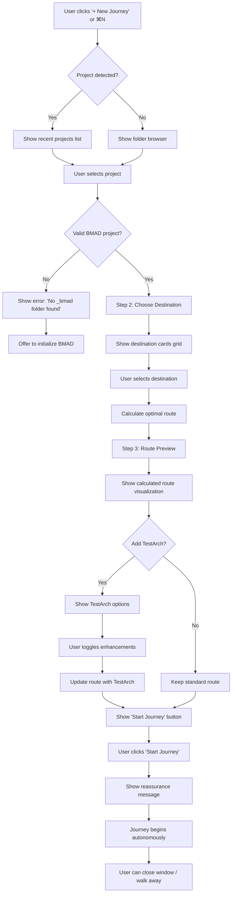
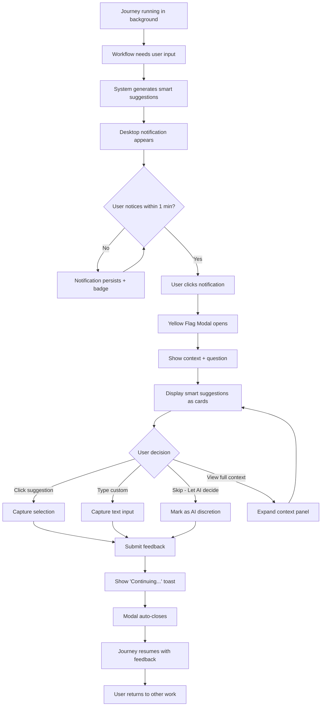
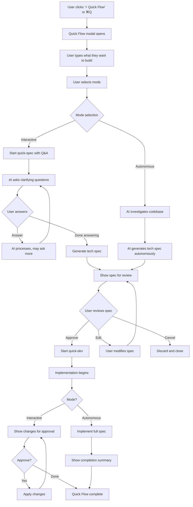
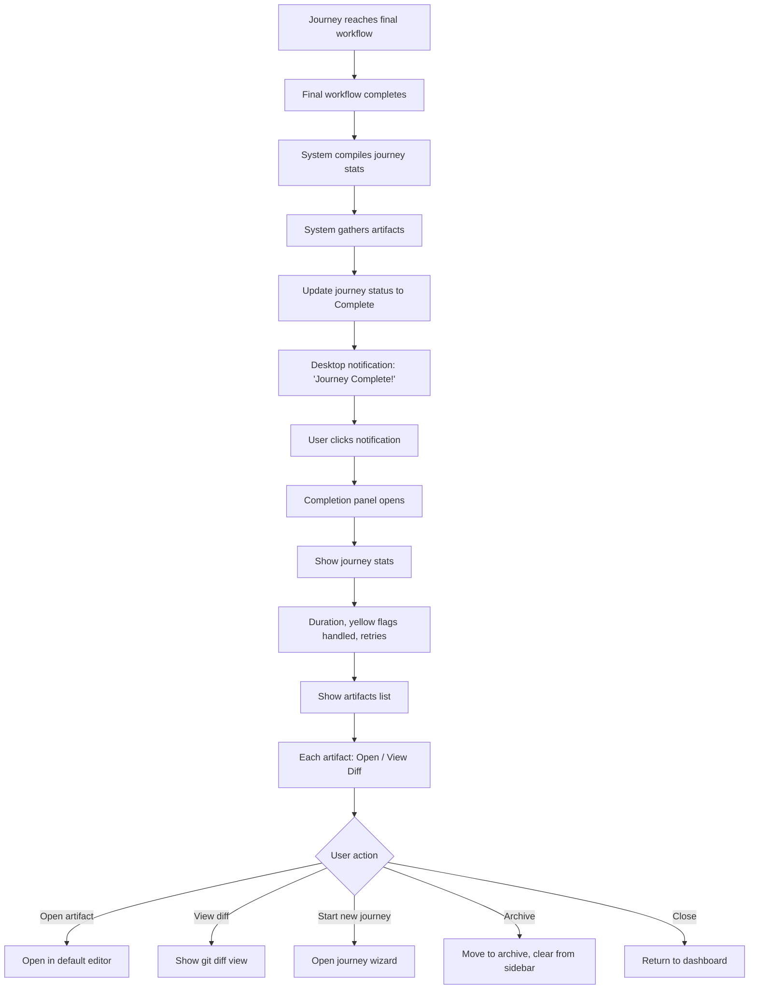
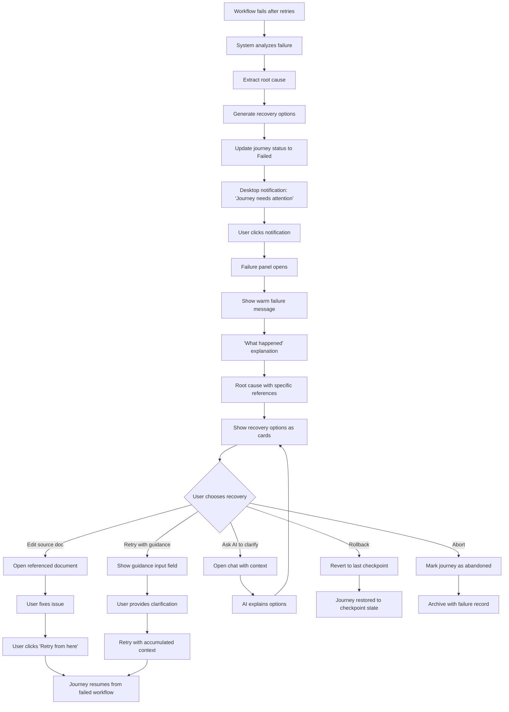
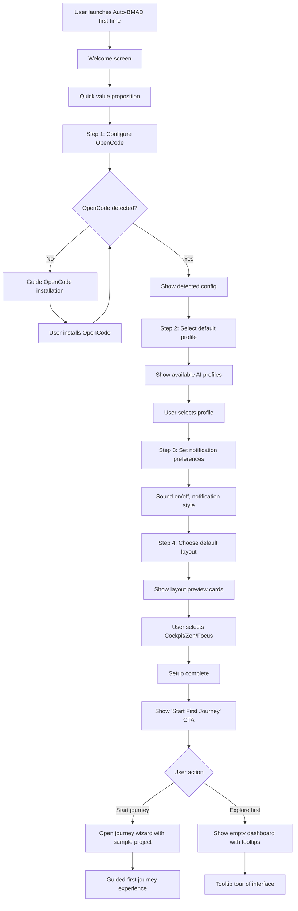

# UX Design Specification: Auto-BMAD

**Author:** Hafiz
**Date:** 2026-01-20

---

## Executive Summary

### Project Vision

Auto-BMAD is an autonomous BMAD workflow orchestration platform that transforms how solo developers interact with AI-assisted development workflows. The core philosophy is **"Set the destination, the system drives the journey. Flow like water."**

This is a desktop application (Electron + Golang) for Linux and macOS that acts as a thin orchestration layer on top of OpenCode CLI. Users set a destination (e.g., "Create Architecture Document") and Auto-BMAD autonomously navigates the entire BMAD workflow journey, allowing developers to context-switch away and return to either completed work or honest failure explanations.

**Key Differentiators:**
- Journey-Driven Architecture (destination-based like GPS, not step-based like task lists)
- Trust Through Honesty (0% false success rate; transparent failure reporting)
- Auto-Retry with Learning (failed workflows retry with accumulated feedback)
- Artifacts as Memory (BMAD outputs are the state; no separate memory layer)
- Thin Layer Philosophy (orchestration only; OpenCode handles AI execution)

### Target Users

**Primary Persona: "The Solo Polymath" — High-Volume BMAD Power User**

- **Representative:** Hafiz and developers like him
- **Context:** Solo developers managing multiple projects simultaneously
- **Volume:** Running 100+ BMAD workflows per day
- **Pain Point:** "Death by a thousand interruptions" — constant workflow babysitting prevents breaks and destroys flow state
- **Current State:** "Hell on earth" — can't walk away from workflows without everything grinding to a halt
- **Desired State:** "Flow like water" — set destination, context-switch to other work, return to results

**Secondary Audience: BMAD Beginners**

- **Context:** Developers new to BMAD workflows or Auto-BMAD
- **Need:** Clear guidance, trust-building through successful first experiences
- **Design Requirement:** Progressive disclosure (simple for beginners, powerful for experts)

**User Success Definition:**
> *"I want to set a destination, walk away, and come back to either completed work or an honest explanation. I didn't have to babysit."*

**Most Critical Pain to Address:** Constant babysitting of workflows (inability to walk away with confidence)

### Key Design Challenges

**1. Building "Walk Away Confidence"**
Users need to trust the system enough to context-switch away for hours. Status communication must be crystal clear, trustworthy, and glanceable. Visual indicators must instantly communicate "green = you're good to walk away."

**2. Onboarding BMAD Beginners While Serving Experts**
Primary user is an expert (100 workflows/day), but the UX must support beginners without adding friction for power users. Progressive disclosure is essential: simple surface, powerful depth available when needed.

**3. Making Honest Failure Feel Like Trust-Building**
Red (failure) states must feel reassuring, not discouraging. Failure UI must communicate transparency, learning potential, and clear recovery options. Frame failures as "the system is being honest with you" not "the system failed you."

**4. Journey Visualization (GPS-Like, Not Task-List-Like)**
This is a new mental model for dev tools (destination-driven, not step-based). Visual metaphor must feel like navigation, not a checklist. Need route visualization showing "you are here" and "destination ahead."

**5. Balancing Ambient Awareness with Deep Work**
Users context-switch to other high-priority work while journeys run. Need awareness without interruption. Notifications must be minimal; glanceable status must be instantly accessible.

### Design Opportunities

**1. Pioneering Journey-Driven UX for Dev Tools**
First BMAD tool with GPS-like navigation metaphor. Feels fundamentally different from task management tools. Innovation: route preview, "recalculating route" on feedback, progress visualization like a road trip.

**2. Emotional Design Around Trust & Honesty**
Make honesty feel *reassuring* through visual language and tone. Builds deeper trust than tools that hide failures. Innovation: honest failure states designed with warmth, clarity, and actionable guidance.

**3. Progressive Disclosure for Beginner-to-Expert Journey**
Serve both audiences without compromise. Accessible to newcomers, powerful for experts. Innovation: default simple journey setup with advanced options revealed contextually as users gain experience.

**4. Glanceable Status for Flow State Preservation**
Enable "check status without breaking flow" through color-coded states (🟢 green, 🟡 yellow, 🔴 red), minimal text, and instant comprehension. Respects developer's deep work sessions.

## Core User Experience

### Defining Experience

**Most Frequent User Action: Responding to Yellow Flags (Providing Feedback)**

The core interaction loop of Auto-BMAD centers on **responding to yellow flags** when the system needs user input to continue a journey. This is the most frequent user action and must be optimized for speed and low friction.

**Ideal Flow:**
1. Journey running in background (user doing other work)
2. Yellow flag appears → Desktop notification
3. User switches to Auto-BMAD → Sees context-aware feedback prompt
4. User provides feedback in < 30 seconds
5. Journey continues autonomously with feedback incorporated
6. User returns to other work

**Critical to Success:** This interaction must feel effortless, not interruptive. The notification-to-response loop should take < 30 seconds total, with clear context that makes feedback easy to provide.

**The Make-or-Break Interaction: "Walk Away with Confidence"**

The defining interaction that determines Auto-BMAD's success or failure:

> **Set Destination → See Calculated Route → Click "Start" → Close Window and Work on Something Else for 2+ Hours**

If users don't feel confident walking away after starting a journey, the entire value proposition ("Flow like water," eliminate babysitting) collapses. This interaction must radiate trustworthiness through:
- Clear route visualization showing journey plan
- Explicit confirmation of notification strategy for yellow/red flags
- Visual language that communicates "I've got this, you can go"

**The "Flow Like Water" Moment:**

The pinnacle experience is when a user:
- Sets a destination
- Sees the calculated route
- Clicks "Start"
- Feels confident enough to close the window and work on something else for 2+ hours
- Returns to either completed work or honest failure explanation

This moment represents the transition from "babysitting workflows" to "autonomous orchestration with trust."

### Platform Strategy

**Platform Type:** Desktop Application (Electron)

**Operating Systems:**
- Linux (MVP) — Primary development platform, x86_64 + ARM64
- macOS (MVP) — Intel + Apple Silicon
- Windows (Post-MVP) — Deferred

**Input Modality:** Mouse/keyboard (desktop interface)

**System Integration:**
- **System Tray:** Post-MVP feature for background operation and glanceable status
- **File Associations:** `.bmad` and `.journey` files open in Auto-BMAD
- **Terminal Integration:** Display OpenCode output in user-configured terminal
- **Always-Running Daemon:** Designed to run continuously with < 500MB idle memory

**Network & Offline Considerations:**
- **Cloud Providers:** Require network connectivity; show network status prominently in UI
- **Local Providers (Ollama):** Support offline operation; indicate provider type clearly
- **UX Decision:** Profile selection UI should clearly indicate cloud vs. local provider to set user expectations

**Multi-Window Strategy:**
- **MVP:** Single window per project, minimize to taskbar when user walks away
- **Post-MVP:** System tray integration for always-available glanceable status
- **Multi-Project:** Users can run multiple Auto-BMAD windows for different projects simultaneously

**Notification Strategy for Yellow Flags (Most Frequent Action):**
- **Desktop Notifications:** Non-intrusive notifications that appear but don't steal focus
- **Visual Alert:** Window taskbar badge/highlight to indicate yellow flag state
- **Sound:** Optional audio notification (user-configurable, off by default)
- **Persistence:** Notification remains until user responds; no auto-dismiss
- **Context:** Notification shows brief context (e.g., "Journey needs input: Architecture phase - Choose database")

### Effortless Interactions

**1. Auto-Retry Based on Feedback and Conditions (The "Magic" Moment)**

When a workflow fails, the system should:
- Automatically retry without user intervention when conditions are recoverable
- Learn from accumulated feedback across retry attempts
- Surface patterns (e.g., "This usually resolves after 2 retries")
- Only escalate to user after retry threshold exceeded

**User Experience:** Feels intelligent and adaptive, not mechanical. User should rarely see individual retry attempts—only the final success or escalated failure.

**2. Instant Status Comprehension (< 1 Second)**

At any moment, user should glance at Auto-BMAD and instantly know:
- 🟢 **Green:** "All good, walk away confidently"
- 🟡 **Yellow:** "Need your input in < 30 seconds"
- 🔴 **Red:** "Honest failure, here's why and how to recover"

**Visual Language:** Color-coded states, minimal text, large status indicators, no ambiguity.

**3. Frictionless Feedback Submission**

When yellow flag appears:
- Context is immediately visible (no searching for "what does it need?")
- Input mechanism is appropriate to question type (text field, selection, file picker, yes/no)
- Submit action is one-click/one-keystroke
- Confirmation is instant ("Journey continuing...")
- User returns to other work in < 30 seconds total

**4. Journey Setup Without Decision Fatigue**

Setting up a journey should be:
- Select project folder (or auto-detect if already configured)
- Choose destination from clear options (e.g., "Architecture Document," "PRD," "Implementation")
- Review calculated route (with option to customize if needed)
- Click "Start Journey"
- Done

**Progressive Disclosure:** Advanced options (retry limits, checkpoint frequency, profile selection) hidden by default, revealed on-demand for power users.

### Critical Success Moments

**1. First "Walk Away" Moment (Trust Building)**

**When:** User sets their first journey, sees calculated route, clicks "Start"

**Success Criteria:**
- User feels confident enough to minimize window and work on something else
- Visual language communicates "I've got this, you're safe to go"
- Route preview makes the journey plan transparent and trustworthy

**Failure Mode:**
- User feels need to keep window open "just in case"
- Uncertainty about what will happen next
- Lack of confidence in notification strategy

**2. First Yellow Flag Response (Frequency Experience)**

**When:** Journey pauses for the first time, yellow flag notification appears

**Success Criteria:**
- User notices notification within 1 minute
- User responds with feedback in < 30 seconds
- Journey continues seamlessly after feedback
- User feels "that was easy, I can handle this"

**Failure Mode:**
- User doesn't notice yellow flag, journey waits indefinitely
- Feedback prompt is confusing or lacks context
- Response process feels slow or cumbersome
- User thinks "this is still babysitting, just with extra steps"

**3. First Honest Failure (Trust Reinforcement)**

**When:** Journey fails and displays red state with explanation

**Success Criteria:**
- User reads failure explanation and thinks "I trust this system even more because it told me the truth"
- Recovery options are clear and actionable
- Root cause explanation is honest, specific, and non-technical (or technically detailed if user is expert)
- User successfully recovers using suggested options

**Failure Mode:**
- User thinks "This system is broken"
- Failure explanation is vague or unhelpful
- No clear path to recovery
- User loses confidence and abandons autonomous mode

**4. First Complete Journey (Value Realization)**

**When:** User returns after 2+ hours to see green completion state

**Success Criteria:**
- User realizes "I just got 4 hours of work done while doing other things"
- Generated artifacts are usable and high-quality
- Completion summary shows journey stats (time saved, retries handled, checkpoints created)
- User thinks "I want to do this for every project"

**Failure Mode:**
- Artifacts are unusable or require significant rework
- Completion state is unclear
- User doesn't understand what was accomplished
- Value realization doesn't happen

### Experience Principles

These principles guide all UX design decisions for Auto-BMAD:

**1. Glanceable Trust**

Status must be instantly comprehensible. User should know "am I good to walk away?" in < 1 second. Large, color-coded visual indicators (🟢🟡🔴) with minimal text. No ambiguity, no cognitive load.

**2. Frictionless Feedback**

Yellow flag responses (most frequent action) must be extremely fast: notification → see context → provide input → continue in < 30 seconds total. Optimize for speed and clarity over comprehensiveness.

**3. Intelligent Autonomy**

Auto-retry with learning should feel magical, not mechanical. System learns from feedback and conditions, adapts without user intervention, and only escalates when genuinely stuck. User should rarely see individual retry attempts—only final outcomes.

**4. Honest Reassurance**

Failures must feel like trust-building moments, not system breakdowns. Clear, specific explanations with actionable recovery options = confidence. Frame as "the system is being honest with you" not "the system failed you."

**5. Calm Confidence**

The UI should radiate "I've got this" energy. Minimal visual noise, calm color palette, confident typography, and reassuring micro-copy. Respect user's flow state by being present when needed, invisible when not.

## Desired Emotional Response

### Primary Emotional Goals

**Core Emotion: Trust & Liberation**

The defining emotional experience of Auto-BMAD is the feeling of **trusted liberation** - users feel confident enough to walk away from running workflows, trusting that the system will either complete successfully or report honest failures with clear recovery paths.

> *"I felt this incredible relief when I realized I could just... walk away. Set it up, close the window, and come back 3 hours later to finished work. It's like hiring an assistant who's brutally honest with you."*

**Supporting Emotions:**

1. **Relief** - Freedom from "babysitting hell" and constant workflow interruptions
2. **Calm & Peace** - "Flow like water" rather than constant stress and context-switching
3. **Empowerment** - Control over destination while delegating journey execution
4. **Reassurance** - Even when things fail, the system provides honest explanations and clear recovery paths
5. **Confidence** - Trust that green means "walk away safely" and yellow/red will notify appropriately

### Emotional Journey Mapping

**1. First Discovery (Skepticism → Cautious Hope)**
- **Current State:** "Another tool that promises autonomy?"
- **Desired Feeling:** Curiosity and cautious hope - "This feels different, let me try it"
- **Design Support:** Clear value proposition, honest about what it does and doesn't do

**2. First Journey Setup (Anxiety → Growing Confidence)**
- **Current State:** "What if I set this up wrong?"
- **Desired Feeling:** Clarity and growing confidence - "This is straightforward, I understand what it's doing"
- **Design Support:** Simple setup flow, route preview shows exactly what will happen

**3. First "Walk Away" Moment (Nervousness → Trust → Liberation)**
- **Current State:** "Should I really close this window?"
- **Desired Feeling:** Trust and liberation - "I'm genuinely walking away, this is amazing"
- **Design Support:** Explicit confirmation that notifications will alert for yellow/red flags, visual language that says "you're safe to go"

**4. First Yellow Flag (Interruption Annoyance → Quick Resolution → Satisfaction)**
- **Current State:** "Ugh, here we go, babysitting again"
- **Desired Feeling:** Quick resolution and satisfaction - "30 seconds and we're moving again"
- **Design Support:** Context-rich notifications, fast feedback submission, instant continuation

**5. First Honest Failure (Potential Discouragement → Reinforced Trust)**
- **Current State:** "It failed, this doesn't work"
- **Desired Feeling:** Reinforced trust - "It told me exactly what went wrong and how to fix it - I trust this even MORE now"
- **Design Support:** Warm, clear failure explanations with actionable recovery options

**6. First Completion (Relief Mixed with Doubt → Accomplishment → Delight)**
- **Current State:** "Did it actually work?"
- **Desired Feeling:** Accomplishment and delight - "I got 4 hours of work done while doing other things!"
- **Design Support:** Clear completion summary with journey stats, easy artifact access

**7. Returning User (Routine Tolerance → Confident Reliance)**
- **Current State:** Routine tolerance
- **Desired Feeling:** Confident reliance - "This is just how I work now"
- **Design Support:** Consistent, predictable behavior that builds habitual trust

### Micro-Emotions

**Trust vs. Skepticism (Critical Importance: Highest)**

**Why Critical:** Without trust, users won't walk away - the core value proposition collapses

**Design Impact:**
- Show calculated route before starting journey
- Explicit notification confirmations
- Progress visibility (always show "where we are")
- No hidden actions - every decision visible in journey log

**Confidence vs. Anxiety (Critical Importance: Highest)**

**Why Critical:** Anxiety prevents "walk away" behavior

**Design Impact:**
- Clear status indicators (🟢🟡🔴)
- Predictable system behavior
- No surprises or unexpected actions
- Obvious control points (pause, stop, settings)

**Relief vs. Frustration (Critical Importance: High)**

**Why Critical:** Core value proposition is eliminating babysitting frustration

**Design Impact:**
- Non-intrusive notifications (don't steal focus)
- Yellow flags resolve in < 30 seconds
- Auto-retry happens silently in background
- Green status means "literally nothing to do"

**Calm vs. Stress (Critical Importance: High)**

**Why Critical:** "Flow like water" philosophy requires calm interface

**Design Impact:**
- Calm color palette (soft blues/greens, warm amber, gentle red)
- Generous whitespace, large touch targets
- Minimal text, maximum clarity
- Smooth, slow animations (nothing jarring)

**Reassurance vs. Discouragement (Critical Importance: Highest - during failures)**

**Why Critical:** Honest failure is a feature, not a bug - must build trust

**Design Impact:**
- Warm, human language in failure states
- Clear root cause explanations without jargon
- Recovery options as helpful suggestions, not errors
- Visual design feels supportive, not alarming

### Design Implications

**Emotion: Trust & Confidence → Design: Transparency & Predictability**
- Show calculated route BEFORE starting journey
- Explicit notification confirmations ("I'll alert you when I need input")
- Progress visibility (always show "where we are" in the journey)
- No hidden actions - every decision visible in journey log

**Emotion: Relief (from babysitting) → Design: Minimal Interruption**
- Non-intrusive notifications (appear but don't steal focus)
- Yellow flags are contextual and quick (< 30 seconds resolution)
- Auto-retry happens silently in background (user only sees final outcome)
- Green status means "literally nothing to do, walk away"

**Emotion: Calm & Peace → Design: Minimalist Visual Language**
- Calm color palette (soft blues/greens for success, warm amber for yellow, gentle red for failure)
- Generous whitespace, large touch targets
- Minimal text, maximum clarity
- Smooth, slow animations (nothing jarring or fast)

**Emotion: Empowerment → Design: Clear Control Points**
- Obvious "pause" and "stop" buttons always visible
- Route customization available (but optional)
- Retry/recovery options clearly presented during failures
- Settings accessible but not required for basic use

**Emotion: Reassurance (during failures) → Design: Warm, Honest Failure UI**
- Failure states use warm, human language ("Here's what happened and why")
- Root cause explained clearly without jargon
- Recovery options presented as helpful suggestions, not errors
- Visual design of red states feels supportive, not alarming

**Emotion: Liberation (from walking away) → Design: Confidence-Building Visual Language**
- "Start Journey" button is prominent and reassuring
- Route preview shows "everything is planned, you're safe to go"
- Confirmation message: "Journey running. You can close this window or minimize to tray."
- First-time user tooltip: "Seriously, you can walk away - I'll notify you if I need anything"

### Emotional Design Principles

**1. Build Trust Through Radical Transparency**

Every action, decision, and state change is visible and explainable. No mystery, no hidden behavior. Users trust what they can see and understand.

**2. Respect Flow State with Calm Minimalism**

Visual language is calm, minimal, and non-stressful. Nothing jarring, nothing urgent unless truly critical. Interface fades into background when not needed.

**3. Transform Failure into Trust-Building Moments**

Honest failures with clear explanations reinforce trust rather than destroy it. Warm, supportive tone + actionable recovery = increased confidence.

**4. Optimize for "Walk Away Confidence"**

Every design decision asks: "Does this make the user more or less confident to walk away?" Route previews, explicit confirmations, and clear status all build liberation.

**5. Make Interruptions Feel Helpful, Not Annoying**

Yellow flags are quick, contextual, and respectful of user's time. The system apologizes for interrupting and makes continuation effortless.

**6. Celebrate Accomplishment**

Completion states emphasize what was achieved (time saved, work completed, retries handled) to reinforce value and build habitual reliance.

## UX Pattern Analysis & Inspiration

### Inspiring Products Analysis

**Developer Tools:**

**1. VS Code (Code Editor)**

*What They Do Well:*
- **Command Palette (Cmd/Ctrl+Shift+P):** Universal search for all actions with zero cognitive load, keyboard-first but mouse-friendly, fuzzy search enables effortless discovery
- **Status Bar:** Bottom bar shows context (git branch, errors, language mode) - always visible, never intrusive, color-coded (blue = normal, orange = warnings, red = errors), clickable for quick actions
- **Sidebar Flexibility:** File explorer, search, git, extensions all in one place with tabs for different views, can collapse entirely for focus mode, persistent state
- **Minimal Visual Noise:** Dark theme, clean icons, generous whitespace - focus on content not chrome, extension-based power (simple by default, powerful when needed)

*Why Users Keep Coming Back:* Feels fast and responsive, predictable behavior builds trust, customizable without being overwhelming

**2. Docker Desktop (Container Management)**

*What They Do Well:*
- **Dashboard Status Indicators:** Green/red dots for container status with instant comprehension (running vs stopped), list view with clear labels, one-click start/stop/restart
- **Resource Visualization:** CPU, memory usage shown for each container with real-time updates, helps diagnose performance issues at a glance
- **Simple Actions, Powerful Controls:** Start/stop obvious, advanced settings hidden - progressive disclosure done right, terminal access with one click for power users
- **Error Messages:** When containers fail, shows logs immediately with no hunting for why something broke, clear next steps (restart, view logs, troubleshoot)

*Why Users Keep Coming Back:* Trust in status indicators (green = actually running), no surprises - behavior is predictable, errors are transparent not hidden

**3. Postman (API Testing)**

*What They Do Well:*
- **Collections Sidebar:** Organized requests by project/folder with clear visual hierarchy, drag-and-drop organization, search within collections
- **Request/Response Split View:** Side-by-side or top/bottom with all relevant info in one screen, tabs for different request types (Params, Headers, Body), color-coded status (200 = green, 4xx = yellow, 5xx = red)
- **Save & Sync:** Auto-saves requests, syncs across devices - no fear of losing work, builds confidence to experiment
- **Visual Feedback:** Sending request shows spinner, completion shows status with clear progress indication, response time displayed prominently

*Why Users Keep Coming Back:* Organized workspace reduces cognitive load, visual feedback at every step, reliable auto-save builds trust

**Productivity Apps:**

**4. Notion**

*What They Do Well:*
- **Block-Based Everything:** Every element is a draggable block - powerful but feels simple, keyboard shortcuts for speed, visual hierarchy through indentation
- **Clean Minimal UI:** Generous whitespace, subtle typography - feels calm not overwhelming, focus on content not UI chrome
- **Progressive Disclosure:** Simple text becomes table/database/kanban when needed - start simple, add complexity only when wanted, no upfront decisions required
- **Slash Commands (/):** Type `/` to insert any block type - discoverability without menus, keyboard-first but beginner-friendly

*Why Users Keep Coming Back:* Beautiful calm interface, flexibility without complexity, feels like thinking not using software

**Terminal Apps:**

**5. WezTerm**

*What They Do Well:*
- **Performance:** Blazingly fast rendering with no lag even with heavy output, trust that it won't slow you down
- **Configurable but Sane Defaults:** Works great out of box, Lua config for power users, beautiful default color schemes
- **Tab Management:** Simple tabs with keyboard shortcuts, clear visual separation, easy context switching

*Why Users Keep Coming Back:* Speed and reliability, beautiful by default, doesn't get in the way

**6. Claude Code (AI Coding Tool)**

*What They Do Well:*
- **Conversational Interface:** Natural language interaction with no learning curve for basic use, context-aware responses
- **Clear Action Buttons:** Accept/Reject changes visibly presented - no ambiguity about what will happen, undo always available
- **Diff View:** Shows exactly what changed - transparency builds trust, easy to spot issues before accepting

*Why Users Keep Coming Back:* Trust through transparency, low friction (just describe what you want), clear control over changes

**UI Inspiration:**

**7. Auto-Claude (Autonomous AI Coding Framework)**

*What They Do Well:*
- **Kanban Board Interface:** Visual task management with all tasks at a glance, clear status progression (Planning → In Progress → Complete), drag-and-drop organization
- **Agent Terminals:** Multiple AI agents working in parallel with real-time progress visibility, one-click context injection, clear separation of parallel work
- **Simple Clean Cards:** Task cards are minimal but informative - no visual clutter, status color-coding, key info at a glance
- **Roadmap View:** Feature planning with AI assistance - strategic view alongside tactical execution, clear visual hierarchy

*Why This Inspires Auto-BMAD:* "Good, simplified, and beautiful UI" - clean kanban layout, real-time agent visibility, minimal but powerful

### Transferable UX Patterns

**Navigation Patterns:**

**1. Sidebar Navigation** (Inspired by: VS Code, Postman)
- Journey list on left sidebar
- Current journey details in main panel
- Collapsible for focus mode
- *Application to Auto-BMAD:* Show all active, paused, and recent journeys in left sidebar with status icons; clicking a journey loads details in main panel

**2. Dashboard-First Approach** (Inspired by: Docker Desktop, Auto-Claude)
- Main view = journey status dashboard
- Quick access to active/paused/failed journeys
- One-click actions (pause, stop, retry)
- *Application to Auto-BMAD:* Landing page shows all journeys as cards in status columns (Running | Yellow Flag | Paused | Complete | Failed)

**3. Command Palette for Quick Actions** (Inspired by: VS Code, Notion `/` commands)
- Cmd/Ctrl+K for quick actions
- "Start journey to [destination]" without clicking around
- Fuzzy search for journey types
- *Application to Auto-BMAD:* Quick journey creation, search past journeys, jump to settings - all keyboard-accessible

**Interaction Patterns:**

**4. Color-Coded Status Indicators** (Inspired by: Docker Desktop, Postman)
- 🟢🟡🔴 large, clear status icons
- Instant comprehension (< 1 second)
- Clickable for more details
- *Application to Auto-BMAD:* Journey cards and sidebar items show prominent status circles; green = walk away safely, yellow = needs input soon, red = failed with explanation

**5. Progressive Disclosure** (Inspired by: Notion, Docker Desktop)
- Journey setup: simple by default (just choose destination)
- "Advanced Options" expandable section for retry limits, profiles, checkpoint frequency
- Beginners never see complexity; experts find it easily
- *Application to Auto-BMAD:* Default journey creation is 3 clicks (project, destination, start); advanced users can expand settings before starting

**6. Real-Time Progress Feedback** (Inspired by: Postman, Docker Desktop)
- Progress bar with current phase name ("Architecture - 40% complete")
- Live OpenCode output stream (optional, collapsible)
- Estimated time remaining based on similar journeys
- *Application to Auto-BMAD:* Journey card shows current workflow phase, step progress, elapsed time; clicking expands to show live terminal output

**7. Kanban-Style Task/Journey View** (Inspired by: Auto-Claude)
- Journeys as cards in columns: Running | Paused | Yellow Flag | Complete | Failed
- Drag between states (e.g., drag failed → retry queue)
- Visual scan of all active work
- *Application to Auto-BMAD:* Main dashboard uses kanban columns for journey status; drag-and-drop for quick state changes

**Visual Patterns:**

**8. Calm Minimalism** (Inspired by: Notion, VS Code)
- Generous whitespace
- Soft color palette (blues/greens, not bright/saturated)
- Typography: Clear hierarchy (large journey name, smaller metadata)
- *Application to Auto-BMAD:* Interface uses calm blues for running state, soft greens for success, warm amber for yellow flags, gentle red for failures; large readable fonts with clear size hierarchy

**9. Persistent Status Bar** (Inspired by: VS Code)
- Bottom bar shows: Current journey phase | Time elapsed | Network status (cloud/local provider)
- Always visible, never intrusive
- Color matches journey state (blue = running, amber = yellow flag, red = failed)
- *Application to Auto-BMAD:* Status bar shows active journey count, current phase of selected journey, OpenCode profile in use, network connectivity indicator

**10. Split View Layouts** (Inspired by: Postman)
- Main view = Journey status dashboard
- Side panel = Route preview OR Failure analysis OR Yellow flag prompt
- Resizable panels
- *Application to Auto-BMAD:* Clicking a journey shows split view - left shows journey timeline/route, right shows current status/output/feedback prompt

**11. Color-Coded Semantic Feedback** (Inspired by: Docker, Postman, VS Code)
- Green = Success, safe to walk away
- Amber/Yellow = Needs input soon
- Red = Failed, honest explanation
- Blue = Running normally
- *Application to Auto-BMAD:* Consistent color language throughout UI; status circles, progress bars, notification badges all use same semantic colors

**Error Handling & Recovery Patterns:**

**12. Immediate Contextual Log Access** (Inspired by: Docker Desktop)
- When journey fails, show failure panel immediately
- Root cause at top, detailed logs expandable below
- Recovery actions as buttons (Retry, Retry from Phase Start, Abort)
- *Application to Auto-BMAD:* Red state shows "Journey failed: [root cause]" prominently with expandable sections for timeline, logs, and recovery options

**13. Human-Readable Status Messages** (Inspired by: Postman, Claude Code)
- Clear language: "Journey failed at Architecture phase: OpenCode process terminated (Out of memory)"
- Not: "Error: Process exited with code 137"
- *Application to Auto-BMAD:* All error messages translated to plain English with technical details available in expandable "Details" section

### Anti-Patterns to Avoid

**1. Hidden Status Indicators**
- *Problem:* Common in CI/CD tools - can't tell if build is running without clicking through multiple screens
- *Why It Fails:* Creates anxiety and forces constant checking; destroys "walk away confidence"
- *Auto-BMAD Solution:* Status always visible on dashboard + system tray badge + optional desktop notifications; never require navigation to check status

**2. Notification Spam**
- *Problem:* Common in Slack, email clients - every minor event triggers notification leading users to ignore all notifications
- *Why It Fails:* Destroys notification trust; users miss critical alerts; interrupts flow state constantly
- *Auto-BMAD Solution:* Only notify for yellow flags (needs input) and failures; batch minor updates into single daily/hourly summary

**3. Overwhelming Setup Wizards**
- *Problem:* Docker, Kubernetes tools - 10+ configuration screens before you can do anything
- *Why It Fails:* Decision fatigue before value realization; beginners abandon during setup; expert users frustrated by forced steps
- *Auto-BMAD Solution:* Sane defaults work immediately (auto-detect project, suggest destination, use default profile); advanced config optional and accessible but never required

**4. Ambiguous Visual States**
- *Problem:* Jenkins, older CI tools - blue? yellow? What does this icon mean?
- *Why It Fails:* Users guess at meaning; ambiguity creates anxiety; requires documentation to understand
- *Auto-BMAD Solution:* 🟢🟡🔴 universally understood colors + text labels always present ("Running," "Needs Input," "Failed"); no icon-only indicators

**5. No Undo/Rollback Capability**
- *Problem:* Many automation tools - "Are you sure?" dialogs but no way to undo after action
- *Why It Fails:* Creates fear of action; users hesitate to experiment; mistakes are catastrophic
- *Auto-BMAD Solution:* Git checkpoints make everything rollback-able; Emergency Stop button always visible; explicit "Rollback to Checkpoint" action

**6. Jargon-Heavy Technical Language**
- *Problem:* AWS Console, Kubernetes - "Pod in CrashLoopBackOff" - what does that mean?
- *Why It Fails:* Excludes beginners; creates learning barrier; forces context-switching to documentation
- *Auto-BMAD Solution:* Human language first ("Journey failed because the system ran out of memory"); technical details expandable for experts

**7. Inconsistent Interaction Patterns**
- *Problem:* Different actions use different paradigms (some buttons, some right-click menus, some keyboard shortcuts with no discoverability)
- *Why It Fails:* Forces users to remember arbitrary rules; slows down workflows; creates frustration
- *Auto-BMAD Solution:* Consistent interaction model - all actions available via button, right-click, and keyboard; command palette makes everything discoverable

### Design Inspiration Strategy

**What to Adopt Directly:**

1. **VS Code Command Palette** → Auto-BMAD Quick Actions (Cmd/Ctrl+K for universal command search)
2. **Docker Desktop Status Indicators** → 🟢🟡🔴 Journey State Indicators with large, clear visual presence
3. **Notion Minimalism** → Calm color palette (soft blues/greens/amber/red), generous whitespace, focus on content
4. **Postman Split View** → Journey dashboard + contextual side panel (route preview, failure analysis, feedback prompt)
5. **Auto-Claude Kanban Board** → Journey cards in status columns (Running | Yellow Flag | Paused | Complete | Failed)
6. **VS Code Status Bar** → Persistent bottom bar showing active journey phase, elapsed time, provider status
7. **Claude Code Clear Actions** → Prominent Accept/Reject/Retry buttons with no ambiguity about outcomes

**What to Adapt for Auto-BMAD Context:**

1. **VS Code Status Bar** → Adapt to show journey-specific context (current workflow phase, elapsed time, OpenCode provider status, network connectivity)
2. **Docker Desktop Dashboard** → Adapt container list view to journey list view with similar status indicators and one-click actions
3. **Notion `/` Commands** → Adapt to journey-specific quick actions (/new-journey, /retry, /view-logs, /open-artifacts)
4. **Postman Collections Organization** → Adapt to journey templates/presets (e.g., "Greenfield Full Stack," "Brownfield Feature Add," "Documentation Only")
5. **Auto-Claude Agent Terminals** → Adapt to show OpenCode process output in collapsible terminal view within journey card

**What to Explicitly Avoid:**

1. **Complex Multi-Step Wizards** → Conflicts with "effortless setup" and "walk away confidence" goals
2. **Unclear Icon-Only Interfaces** → Conflicts with "glanceable trust" and "instant comprehension" principles
3. **Aggressive Notification Strategies** → Conflicts with "flow state preservation" and "calm confidence" goals
4. **Technical Jargon Without Translation** → Conflicts with "beginner-friendly" and "progressive disclosure" requirements
5. **Hidden Advanced Features** → Conflicts with "power user shortcuts" and "expert-friendly" goals (use progressive disclosure, not hiding)
6. **Inconsistent Visual Language** → Conflicts with "predictable behavior" and "trust building" principles

**Strategic Application:**

*For Beginners:*
- Auto-Claude-style kanban provides visual familiarity
- Notion-style minimalism reduces overwhelm
- Docker-style status indicators provide instant comprehension
- Command palette provides discoverability without menu hunting

*For Experts (like Hafiz):*
- VS Code-style keyboard shortcuts for speed
- Postman-style advanced options available but not required
- WezTerm-style performance (no lag, no blocking)
- Claude Code-style transparency (always see what's happening)

*For Trust Building:*
- Docker-style honest status (green actually means safe)
- Claude Code-style diff view (show exactly what changed)
- Postman-style visual feedback at every step
- VS Code-style predictable, consistent behavior

This strategy ensures Auto-BMAD feels **simple and beautiful** (Notion, Auto-Claude) while being **trustworthy and powerful** (VS Code, Docker Desktop, Postman) for both beginners and experts.

## Design System Foundation

### Methodology UI Model

Auto-BMAD supports **three distinct but interconnected workflow approaches** that must coexist in a unified interface:

**1. Core BMAD Method (4-Phase Journey) — 80% of Usage**
```
Phase 1: Analysis → Phase 2: Planning → Phase 3: Solutioning → Phase 4: Implementation
```
- 14 core workflows (brainstorming, PRD, architecture, epics, stories, dev, etc.)
- Journey-driven, destination-based navigation
- Primary kanban board visualization

**2. TestArch Enhancement Layer (8 Specialized Workflows) — Per-Card Toggle**

TestArch workflows are **enhancement cards** that can be toggled on/off individually within the journey:

| Workflow | Purpose | Phase Integration |
|----------|---------|-------------------|
| `testarch-framework` | Setup test infrastructure | Pre-Implementation |
| `testarch-atdd` | Generate tests BEFORE implementation (TDD) | Pre-dev within stories |
| `testarch-automate` | Generate tests AFTER implementation | Post-dev within stories |
| `testarch-test-design` | System/Epic-level test planning | Phase 3 (Solutioning) |
| `testarch-trace` | Requirements ↔ Tests traceability | Pre-release |
| `testarch-nfr` | Non-functional requirements validation | Pre-release |
| `testarch-ci` | CI/CD pipeline scaffolding | After test framework |
| `testarch-test-review` | Test quality review | Anytime |

**UI Behavior:** TestArch workflows appear as optional cards with a 🧪 badge. Users can add/remove them per-phase without affecting the core journey flow.

**3. Quick Flow (Lightweight 2-Step) — 20% of Usage**
```
quick-spec → quick-dev (no phases, no journey tracking)
```
- Conversational spec engineering followed by flexible development
- Separate panel/section in the dashboard
- Simpler 3-column kanban: Speccing → Implementing → Done

### Dashboard Layout Architecture

**Unified View Supporting Simultaneous Methodologies:**

```
┌─────────────────────────────────────────────────────────────────────────────┐
│  AUTO-BMAD  [project-name]                         🟢 3 Active  🟡 1 Input  │
├─────────────────────────────────────────────────────────────────────────────┤
│                                                                             │
│  ┌─ JOURNEY: [Journey Name] ─────────────────────────────────────────────┐ │
│  │                                                                        │ │
│  │  Analysis    Planning      Solutioning       Implementation   Complete │ │
│  │  ─────────   ─────────     ───────────       ──────────────   ──────── │ │
│  │  [card 🟢]   [card 🟢]     [card 🟡]         [card 🔵]                │ │
│  │              [card 🟢]     [card ⏳]                                   │ │
│  │                            [🧪card]          [🧪card]                  │ │
│  │                            (testarch)         (testarch)               │ │
│  │                                                                        │ │
│  │  [+ Add Workflow]  [+ Add TestArch ▾]                                 │ │
│  └────────────────────────────────────────────────────────────────────────┘ │
│                                                                             │
│  ┌─ QUICK FLOW ──────────────────────────────────────────────── [+ New] ─┐ │
│  │  Speccing              Implementing              Done                  │ │
│  │  ────────              ────────────              ────                  │ │
│  │  [spec 🟡]             [dev 🟢]                  [done ✓]             │ │
│  └────────────────────────────────────────────────────────────────────────┘ │
│                                                                             │
└─────────────────────────────────────────────────────────────────────────────┘
```

**Key Layout Decisions:**

1. **80/20 Split:** Journey section is primary (larger), Quick Flow is secondary (collapsible panel)
2. **TestArch Integration:** Enhancement cards appear inline with 🧪 badge, added via `[+ Add TestArch ▾]` dropdown per phase
3. **Visual Distinction:** TestArch cards use dashed borders or subtle accent to distinguish from core workflows
4. **Simultaneous Operation:** Both Journey and Quick Flow sections visible and operational concurrently

### Design System Choice: shadcn/ui (Radix UI + Tailwind CSS)

**Recommendation:** **shadcn/ui** — Copy-paste component library built on Radix UI primitives with Tailwind CSS styling.

**Why shadcn/ui for Auto-BMAD:**

| Criterion | shadcn/ui Fit |
|-----------|---------------|
| **Solo Developer** | ✅ Copy-paste components, no dependency lock-in, full ownership |
| **MVP Speed** | ✅ Pre-built components accelerate development significantly |
| **Minimal Aesthetic** | ✅ Clean, modern defaults aligned with Notion-like calm minimalism |
| **Desktop (Electron)** | ✅ React-based, works seamlessly in Electron renderer |
| **Customization** | ✅ Full source access, Tailwind utilities for rapid iteration |
| **Accessibility** | ✅ Radix primitives include ARIA compliance out of box |
| **Dark Mode** | ✅ Built-in dark mode support with CSS variables |

**Component Strategy for Methodology Support:**

| UI Element | shadcn/ui Component | Customization Needed |
|------------|---------------------|---------------------|
| Journey Kanban Board | Custom (Radix DnD + Card) | Build on Card component |
| Workflow Cards | Card + Badge | Add 🧪 badge variant for TestArch |
| Status Indicators | Badge (custom colors) | 🟢🟡🔴🔵 semantic color variants |
| Quick Flow Panel | Collapsible + Card | Lighter weight card variant |
| Command Palette | Command (cmdk) | Already included, VS Code-style |
| Yellow Flag Modal | Dialog + Form | Context-aware feedback forms |
| Status Bar | Custom footer | Build with Tailwind |
| Side Panel | Sheet or custom | Route preview, failure analysis |

**Color System for Status States:**

```css
/* Semantic Status Colors (CSS Variables) */
--status-running: hsl(217, 91%, 60%);     /* Blue - actively processing */
--status-success: hsl(142, 76%, 36%);     /* Green - walk away safely */
--status-warning: hsl(38, 92%, 50%);      /* Amber - needs input (yellow flag) */
--status-error: hsl(0, 72%, 51%);         /* Red - honest failure */
--status-pending: hsl(215, 16%, 47%);     /* Gray - queued/waiting */

/* TestArch Enhancement Accent */
--testarch-accent: hsl(262, 83%, 58%);    /* Purple - distinguishes testarch cards */
```

**Typography & Spacing:**

- **Font:** Inter (clean, readable, widely supported)
- **Hierarchy:** 
  - Journey Name: 24px semibold
  - Phase Headers: 14px medium uppercase
  - Card Titles: 16px medium
  - Card Metadata: 12px regular muted
- **Spacing:** 8px base unit (8, 16, 24, 32, 48)
- **Card Padding:** 16px internal, 8px gap between cards

### Component Architecture

**Workflow Card Variants:**

```
┌─────────────────────────────┐
│ 🟢 PRD v1.1                 │  ← Standard Workflow Card
│ Planning • Completed        │
│ 45m • 2 retries handled     │
└─────────────────────────────┘

┌─────────────────────────────┐
│ 🧪🟡 Test Design            │  ← TestArch Enhancement Card
│ Solutioning • Needs Input   │     (🧪 badge + dashed border)
│ 12m • Awaiting test scope   │
└─────────────────────────────┘

┌─────────────────────────────┐
│ ⚡🟢 webhook-feat           │  ← Quick Flow Card
│ Implementing • Running      │     (⚡ badge + compact)
│ 8m                          │
└─────────────────────────────┘
```

**Card Visual Differentiation:**

| Card Type | Badge | Border Style | Background |
|-----------|-------|--------------|------------|
| Standard Workflow | Status dot only | Solid 1px | Default card bg |
| TestArch Enhancement | 🧪 + Status dot | Dashed 1px | Subtle purple tint |
| Quick Flow | ⚡ + Status dot | Solid 1px | Slightly lighter bg |

### Accessibility Considerations

**WCAG 2.1 AA Compliance:**

- **Color Contrast:** All status colors meet 4.5:1 contrast ratio against backgrounds
- **Focus Indicators:** Visible focus rings on all interactive elements (Radix default)
- **Keyboard Navigation:** Full keyboard support via Radix primitives
- **Screen Reader:** ARIA labels on status indicators ("Journey running", "Needs your input", "Failed - click for details")
- **Motion:** Respect `prefers-reduced-motion` for animations

**Desktop-Specific Accessibility:**

- **Large Click Targets:** Minimum 44x44px for primary actions
- **Hover States:** Clear visual feedback on hover (not required for touch)
- **Keyboard Shortcuts:** All major actions have keyboard shortcuts (documented in command palette)

### Design System Rationale Summary

**Why This Approach Works for Auto-BMAD:**

1. **Speed to MVP:** shadcn/ui's copy-paste model means we own the components and can ship fast
2. **Methodology Flexibility:** Component architecture supports Journey + TestArch + Quick Flow without UI fragmentation
3. **Calm Minimalism:** Tailwind + shadcn defaults align with Notion-inspired calm aesthetic
4. **Trust-Building UI:** Clear status colors, accessible components, and predictable behavior build confidence
5. **Solo Dev Maintainability:** No external component library dependencies to manage long-term
6. **Future Extensibility:** Full source ownership allows deep customization as product evolves

## Defining Core Experience

### The Defining Experience

**Auto-BMAD's One-Liner:**

> **"Set your destination, walk away, come back to results"**

This is the **Walk Away Moment** — the core interaction that, if nailed, makes everything else follow. Users should feel confident enough to close the laptop, go to sleep, and wake up to completed work (or honest failure explanations).

**Why This Defines Auto-BMAD:**
- It's what users will tell their friends: *"I just set it up and walked away for 3 hours"*
- It directly addresses the core pain: *"Death by a thousand interruptions"*
- It embodies the philosophy: *"Flow like water"*

### User Mental Model

**Current Reality (Pre-Auto-BMAD):**
- Manual Claude Code invocation per workflow
- Constant terminal monitoring ("Is it still running? Did it error?")
- Context-switching penalty every time workflow needs input
- Fear of walking away ("What if it breaks while I'm gone?")

**Mental Model Shift Required:**

| From | To |
|------|-----|
| "I run workflows" | "I set destinations" |
| "I monitor progress" | "I trust the system to notify me" |
| "Failures are bad" | "Honest failures build trust" |
| "Stay engaged" | "Walk away confidently" |

**Familiar Metaphors to Leverage:**
- **GPS Navigation:** Set destination, system calculates route, recalculates on obstacles
- **Sous Chef:** Give instructions, they handle execution, only interrupt for decisions
- **CI/CD Pipeline:** Trigger build, go do other work, check results later

### Success Criteria for Core Experience

**The "This Just Works" Feeling:**

| Criteria | Measurement |
|----------|-------------|
| **Trust at Start** | User clicks "Start Journey" and immediately minimizes window |
| **Notification Confidence** | User trusts yellow flags will appear when needed |
| **Quick Resolution** | Yellow flag → Response → Continue in < 30 seconds |
| **Honest Failure** | Red state makes user trust MORE, not less |
| **Value Realization** | User says "I got 4 hours of work done while sleeping" |

**Success Indicators:**
1. ✅ User walks away within 10 seconds of starting journey
2. ✅ Yellow flag response completes in < 30 seconds
3. ✅ User runs multiple journeys concurrently without anxiety
4. ✅ First failure increases trust (honest explanation + clear recovery)
5. ✅ User becomes "addicted" to starting journeys before bed/lunch

### Novel vs. Established Patterns

**Pattern Analysis:**

| Aspect | Pattern Type | Approach |
|--------|--------------|----------|
| Journey Setup | **Established** (Wizard) | 3-step wizard familiar from installers |
| Kanban Dashboard | **Established** | Proven in Trello, Notion, Auto-Claude |
| Status Colors | **Established** | Universal 🟢🟡🔴 traffic light system |
| "Walk Away" Trust | **Novel** | New for dev tools — needs trust-building UI |
| TestArch Toggle | **Novel** | Enhancement cards as first-class citizens |
| Smart Suggestions | **Adapted** | Form auto-complete adapted to workflow context |

**Novel Pattern: "Walk Away Confidence" UI**

This is Auto-BMAD's UX innovation. Dev tools typically expect constant engagement. We need to actively communicate "you can leave now" through:
- Explicit reassurance text ("I've got this, you can go")
- Route preview showing planned autonomy
- Notification confirmation ("I'll alert you when I need input")
- First-time tooltip: "Seriously, you can walk away"

### Experience Mechanics

#### Flow A: Journey Start (Wizard Steps)

**Step 1: Select Project**
```
┌─────────────────────────────────────────────┐
│  SELECT PROJECT                    Step 1/3 │
├─────────────────────────────────────────────┤
│                                             │
│  📁 Recent Projects:                        │
│  ┌─────────────────────────────────────┐   │
│  │ ● auto-bmad       ~/projects/...    │   │
│  │ ○ my-saas-app     ~/projects/...    │   │
│  │ ○ client-project  ~/projects/...    │   │
│  └─────────────────────────────────────┘   │
│                                             │
│  [Browse Other Folder...]                   │
│                                             │
│              [Cancel]  [Next →]             │
└─────────────────────────────────────────────┘
```

**Step 2: Choose Destination**
```
┌─────────────────────────────────────────────┐
│  CHOOSE DESTINATION                Step 2/3 │
├─────────────────────────────────────────────┤
│                                             │
│  Where should this journey end?             │
│                                             │
│  ┌─────────┐ ┌─────────┐ ┌─────────┐       │
│  │ 📋      │ │ 🎨      │ │ 🏗️      │       │
│  │ PRD     │ │ UX Spec │ │ Arch    │       │
│  └─────────┘ └─────────┘ └─────────┘       │
│  ┌─────────┐ ┌─────────┐ ┌─────────┐       │
│  │ 📦      │ │ 🚀      │ │ ⚙️      │       │
│  │ Epics   │ │ Sprint  │ │ Custom  │       │
│  │         │ │ Ready   │ │         │       │
│  └─────────┘ └─────────┘ └─────────┘       │
│                                             │
│          [← Back]  [Next →]                 │
└─────────────────────────────────────────────┘
```

**Step 3: Route Preview & Enhancements**
```
┌─────────────────────────────────────────────┐
│  REVIEW ROUTE                      Step 3/3 │
├─────────────────────────────────────────────┤
│                                             │
│  CALCULATED ROUTE:                          │
│  ┌─────────────────────────────────────┐   │
│  │ Analysis → Planning → Solutioning   │   │
│  │    ↓          ↓           ↓         │   │
│  │  Brief      PRD         Arch        │   │
│  │             UX          Epics       │   │
│  │                        [🧪 test]    │   │
│  └─────────────────────────────────────┘   │
│                                             │
│  ENHANCEMENTS (Optional):                   │
│  [+ Add TestArch Workflows ▾]               │
│    ☑️ test-design  ☐ atdd  ☐ trace         │
│                                             │
│  ┌─────────────────────────────────────┐   │
│  │ 🟢 START JOURNEY                    │   │
│  │                                      │   │
│  │ "I'll notify you when I need input. │   │
│  │  You can close this window."        │   │
│  └─────────────────────────────────────┘   │
│                                             │
│          [← Back]                           │
└─────────────────────────────────────────────┘
```

**Mechanics Summary:**

| Step | User Action | System Response |
|------|-------------|-----------------|
| 1. Project | Click recent or browse | Validates BMAD setup |
| 2. Destination | Click destination card | Calculates optimal route |
| 3. Review | Optional: add TestArch | Shows complete journey plan |
| Start | Click green button | Journey begins, reassurance shown |

#### Flow B: Yellow Flag Response (Smart Suggestions)

**Notification → Modal Flow:**

```
┌──────────────────────────────────────────────────────────────┐
│  🟡 JOURNEY NEEDS INPUT                                      │
├──────────────────────────────────────────────────────────────┤
│                                                              │
│  Journey: Greenfield MVP                                     │
│  Phase: Solutioning → Workflow: create-architecture          │
│                                                              │
│  ────────────────────────────────────────────────────────    │
│                                                              │
│  📋 QUESTION:                                                │
│  "Which database approach for user data storage?"            │
│                                                              │
│  CONTEXT:                                                    │
│  Your PRD mentions both PostgreSQL and SQLite as options.    │
│  I need your decision to proceed with the architecture.      │
│                                                              │
│  SMART SUGGESTIONS:                                          │
│  ┌────────────────┐ ┌────────────────┐ ┌────────────────┐   │
│  │ 🐘 PostgreSQL  │ │ 📦 SQLite      │ │ 🔀 Both        │   │
│  │ Scale-ready    │ │ Simple/embed   │ │ SQLite dev,    │   │
│  │ Recommended    │ │ Single-user    │ │ Postgres prod  │   │
│  └────────────────┘ └────────────────┘ └────────────────┘   │
│                                                              │
│  Or provide custom input:                                    │
│  [______________________________________________] [Submit]   │
│                                                              │
│  [Skip - Let AI Decide]              [View Full Context →]   │
│                                                              │
└──────────────────────────────────────────────────────────────┘
```

**Mechanics Summary:**

| Step | User Action | System Response | Time Target |
|------|-------------|-----------------|-------------|
| Notice | See notification | Shows badge + brief context | — |
| Open | Click notification | Modal appears with full context | < 2s |
| Decide | Click suggestion OR type | Input captured | < 20s |
| Continue | Auto-close on submit | "Continuing..." toast, journey resumes | < 5s |
| **Total** | | | **< 30s** |

**Smart Suggestion Generation:**
- System analyzes question context
- Pulls relevant options from PRD/Architecture/existing artifacts
- Presents 2-3 most likely choices as clickable cards
- Always allows free-text override

#### Flow C: Quick Flow (Dual-Mode: Interactive OR Fire-and-Forget)

**Creation (Minimal Friction):**

```
┌──────────────────────────────────────────────────────────────┐
│  ⚡ NEW QUICK FLOW                                           │
├──────────────────────────────────────────────────────────────┤
│                                                              │
│  What do you want to build?                                  │
│                                                              │
│  [Add Stripe webhook endpoint for payment events_______]     │
│                                                              │
│  MODE:                                                       │
│  ○ 💬 Interactive - I'll answer questions as they come      │
│  ● 🚀 Autonomous - Spec it, then implement (I'll review)    │
│                                                              │
│  ┌──────────────────────────────────────────────────────┐   │
│  │  ⚡ START                                             │   │
│  └──────────────────────────────────────────────────────┘   │
│                                                              │
└──────────────────────────────────────────────────────────────┘
```

**Dual-Mode Behavior:**

| Mode | Spec Phase | Dev Phase | Best For |
|------|------------|-----------|----------|
| **Interactive** | Back-and-forth Q&A | User approves each change | Complex features, learning |
| **Autonomous** | AI investigates, produces spec | Implements after spec approval | Simple features, trusted patterns |

**Quick Flow Card States:**
```
Speccing → [Spec Ready for Review] → Implementing → Done
   🟡              🟢                    🔵          ✓
```

#### Flow D: TestArch Card Toggle

**Adding TestArch Enhancement (In Journey Setup or Mid-Journey):**

```
┌──────────────────────────────────────────────────────────────┐
│  + ADD TESTARCH WORKFLOWS                                    │
├──────────────────────────────────────────────────────────────┤
│                                                              │
│  Available for this journey:                                 │
│                                                              │
│  SOLUTIONING PHASE:                                          │
│  ┌──────────────────────────────────────────────────────┐   │
│  │ ☑️ 🧪 test-design                                     │   │
│  │    System-level testability review                    │   │
│  │    Adds ~30min to journey                             │   │
│  └──────────────────────────────────────────────────────┘   │
│                                                              │
│  IMPLEMENTATION PHASE:                                       │
│  ┌──────────────────────────────────────────────────────┐   │
│  │ ☐ 🧪 atdd                                             │   │
│  │    Generate tests BEFORE implementation (TDD)         │   │
│  │    Adds ~20min per story                              │   │
│  └──────────────────────────────────────────────────────┘   │
│  ┌──────────────────────────────────────────────────────┐   │
│  │ ☐ 🧪 test-trace                                       │   │
│  │    Requirements ↔ Tests traceability matrix           │   │
│  │    Adds ~15min before release                         │   │
│  └──────────────────────────────────────────────────────┘   │
│                                                              │
│                              [Cancel]  [Apply Changes]       │
│                                                              │
└──────────────────────────────────────────────────────────────┘
```

**Mechanics:**
- TestArch cards are **opt-in** (not shown by default)
- Each shows estimated time impact
- Can be added at journey start OR mid-journey
- Removing mid-journey: only if not yet started

#### Flow E: Completion & Failure Review

**Completion State:**

```
┌──────────────────────────────────────────────────────────────┐
│  🟢 JOURNEY COMPLETE                                         │
├──────────────────────────────────────────────────────────────┤
│                                                              │
│  Greenfield MVP → Implementation Ready                       │
│                                                              │
│  ────────────────────────────────────────────────────────    │
│                                                              │
│  📊 JOURNEY STATS:                                           │
│  • Duration: 3h 42m (you were away for 3h 15m)              │
│  • Yellow flags handled: 4                                   │
│  • Auto-retries: 2 (resolved automatically)                  │
│  • Artifacts created: 6                                      │
│                                                              │
│  📁 ARTIFACTS:                                               │
│  ┌────────────────────────────────────────────────────┐     │
│  │ 📋 prd.md                    [Open] [View Diff]    │     │
│  │ 🎨 ux-design-specification.md [Open] [View Diff]   │     │
│  │ 🏗️ architecture.md           [Open] [View Diff]    │     │
│  │ 📦 epics/                    [Open Folder]         │     │
│  └────────────────────────────────────────────────────┘     │
│                                                              │
│  [Start New Journey]  [View Journey Log]  [Archive]          │
│                                                              │
└──────────────────────────────────────────────────────────────┘
```

**Failure State (Honest & Warm):**

```
┌──────────────────────────────────────────────────────────────┐
│  🔴 JOURNEY STOPPED                                          │
├──────────────────────────────────────────────────────────────┤
│                                                              │
│  Greenfield MVP → Architecture (Phase 3)                     │
│                                                              │
│  ────────────────────────────────────────────────────────    │
│                                                              │
│  💬 WHAT HAPPENED:                                           │
│  "I couldn't complete the architecture document because      │
│   the PRD has conflicting requirements for user auth.        │
│   I tried 3 different approaches but each hit the same       │
│   contradiction."                                            │
│                                                              │
│  🔍 ROOT CAUSE:                                              │
│  PRD Section 4.2 says "OAuth only" but Section 6.1 says      │
│  "support email/password for enterprise customers"           │
│                                                              │
│  🛠️ RECOVERY OPTIONS:                                        │
│  ┌────────────────┐ ┌────────────────┐ ┌────────────────┐   │
│  │ 📝 Edit PRD    │ │ 🔄 Retry with  │ │ 💬 Ask me      │   │
│  │ Fix conflict   │ │ guidance       │ │ to clarify     │   │
│  │ then retry     │ │ "Use OAuth +   │ │                │   │
│  │                │ │  email for..." │ │                │   │
│  └────────────────┘ └────────────────┘ └────────────────┘   │
│                                                              │
│  [View Full Journey Log]  [Rollback to Last Checkpoint]      │
│                                                              │
└──────────────────────────────────────────────────────────────┘
```

**Failure UX Principles:**
- **Warm language:** "What happened" not "Error"
- **Specific root cause:** Points to exact document/section conflict
- **Actionable recovery:** Clear buttons for next steps
- **No blame:** System explains its attempts, doesn't blame user

## Visual Design Foundation

### Color System

**Philosophy: "Calm Trust"**

Auto-BMAD's color system is designed to evoke trust, calm, and confidence. Colors are muted and soft rather than bright and saturated, supporting the "flow like water" philosophy and enabling users to walk away with confidence.

**Semantic Status Colors:**

| Status | Color Name | Hex | RGB | Usage |
|--------|------------|-----|-----|-------|
| **Running** | Slate Blue | `#3B82F6` | `59, 130, 246` | Active journey, processing state |
| **Success** | Emerald | `#10B981` | `16, 185, 129` | Walk away safely, complete |
| **Warning** | Amber | `#F59E0B` | `245, 158, 11` | Yellow flags, needs user input |
| **Error** | Rose | `#F43F5E` | `244, 63, 94` | Honest failures (warm, not harsh) |
| **Neutral** | Slate | `#64748B` | `100, 116, 139` | Pending, inactive, secondary |

**Enhancement Accent Colors:**

| Type | Color Name | Hex | Usage |
|------|------------|-----|-------|
| **TestArch** | Violet | `#8B5CF6` | 🧪 TestArch enhancement cards |
| **Quick Flow** | Cyan | `#06B6D4` | ⚡ Quick Flow cards |

**Background & Surface Colors:**

| Role | Light Mode | Dark Mode |
|------|------------|-----------|
| **Background** | `#FAFAFA` | `#0F172A` |
| **Surface** | `#FFFFFF` | `#1E293B` |
| **Surface Elevated** | `#FFFFFF` | `#334155` |
| **Border** | `#E2E8F0` | `#334155` |
| **Text Primary** | `#0F172A` | `#F8FAFC` |
| **Text Secondary** | `#64748B` | `#94A3B8` |
| **Text Muted** | `#94A3B8` | `#64748B` |

**CSS Custom Properties:**

```css
:root {
  /* Status Colors */
  --color-running: 217 91% 60%;      /* #3B82F6 */
  --color-success: 160 84% 39%;      /* #10B981 */
  --color-warning: 38 92% 50%;       /* #F59E0B */
  --color-error: 347 77% 60%;        /* #F43F5E */
  --color-neutral: 215 16% 47%;      /* #64748B */
  
  /* Accent Colors */
  --color-testarch: 258 90% 66%;     /* #8B5CF6 */
  --color-quickflow: 189 94% 43%;    /* #06B6D4 */
  
  /* Light Mode Surfaces */
  --color-background: 0 0% 98%;      /* #FAFAFA */
  --color-surface: 0 0% 100%;        /* #FFFFFF */
  --color-border: 214 32% 91%;       /* #E2E8F0 */
  
  /* Light Mode Text */
  --color-text-primary: 222 47% 11%; /* #0F172A */
  --color-text-secondary: 215 16% 47%; /* #64748B */
  --color-text-muted: 215 20% 65%;   /* #94A3B8 */
}

.dark {
  /* Dark Mode Surfaces */
  --color-background: 222 47% 11%;   /* #0F172A */
  --color-surface: 217 33% 17%;      /* #1E293B */
  --color-surface-elevated: 215 25% 27%; /* #334155 */
  --color-border: 215 25% 27%;       /* #334155 */
  
  /* Dark Mode Text */
  --color-text-primary: 210 40% 98%; /* #F8FAFC */
  --color-text-secondary: 215 20% 65%; /* #94A3B8 */
  --color-text-muted: 215 16% 47%;   /* #64748B */
}
```

**Color Accessibility:**

| Combination | Contrast Ratio | WCAG Level |
|-------------|----------------|------------|
| Text Primary on Background | 15.8:1 | AAA ✅ |
| Text Secondary on Background | 4.6:1 | AA ✅ |
| Success on Background | 4.5:1 | AA ✅ |
| Warning on Background | 3.1:1 | AA Large ✅ |
| Error on Background | 4.5:1 | AA ✅ |

### Typography System

**Font Stack:**

| Role | Font Family | Fallback Stack |
|------|-------------|----------------|
| **UI/Body** | Inter | `-apple-system, BlinkMacSystemFont, 'Segoe UI', sans-serif` |
| **Code/Terminal** | JetBrains Mono | `'Fira Code', 'SF Mono', Consolas, monospace` |

**Type Scale:**

| Element | Size | Weight | Line Height | Letter Spacing |
|---------|------|--------|-------------|----------------|
| **Display (Journey Title)** | 28px / 1.75rem | 600 Semibold | 1.2 | -0.02em |
| **H1 (Page Title)** | 24px / 1.5rem | 600 Semibold | 1.25 | -0.01em |
| **H2 (Section)** | 20px / 1.25rem | 600 Semibold | 1.3 | -0.01em |
| **H3 (Card Title)** | 16px / 1rem | 500 Medium | 1.4 | 0 |
| **Body** | 14px / 0.875rem | 400 Regular | 1.5 | 0 |
| **Body Small** | 13px / 0.8125rem | 400 Regular | 1.5 | 0 |
| **Caption** | 12px / 0.75rem | 400 Regular | 1.4 | 0.01em |
| **Overline** | 11px / 0.6875rem | 500 Medium | 1.4 | 0.05em |
| **Code** | 13px / 0.8125rem | 400 Regular | 1.5 | 0 |

**Typography CSS:**

```css
:root {
  /* Font Families */
  --font-sans: 'Inter', -apple-system, BlinkMacSystemFont, 'Segoe UI', sans-serif;
  --font-mono: 'JetBrains Mono', 'Fira Code', 'SF Mono', Consolas, monospace;
  
  /* Font Sizes */
  --text-xs: 0.6875rem;    /* 11px */
  --text-sm: 0.75rem;      /* 12px */
  --text-base: 0.875rem;   /* 14px */
  --text-md: 1rem;         /* 16px */
  --text-lg: 1.25rem;      /* 20px */
  --text-xl: 1.5rem;       /* 24px */
  --text-2xl: 1.75rem;     /* 28px */
  
  /* Font Weights */
  --font-normal: 400;
  --font-medium: 500;
  --font-semibold: 600;
  
  /* Line Heights */
  --leading-tight: 1.2;
  --leading-snug: 1.3;
  --leading-normal: 1.4;
  --leading-relaxed: 1.5;
}
```

### Spacing & Layout Foundation

**Base Unit: 8px**

All spacing derives from an 8px base unit, creating consistent rhythm throughout the interface.

**Spacing Scale:**

| Token | Value | Pixels | Usage |
|-------|-------|--------|-------|
| `space-0.5` | 0.125rem | 2px | Micro adjustments |
| `space-1` | 0.25rem | 4px | Tight gaps, icon padding |
| `space-2` | 0.5rem | 8px | Small gaps, inline spacing |
| `space-3` | 0.75rem | 12px | Form field gaps |
| `space-4` | 1rem | 16px | Card padding, standard gaps |
| `space-5` | 1.25rem | 20px | Medium section gaps |
| `space-6` | 1.5rem | 24px | Large gaps, modal padding |
| `space-8` | 2rem | 32px | Section breaks |
| `space-10` | 2.5rem | 40px | Major section gaps |
| `space-12` | 3rem | 48px | Page section spacing |

**Border Radius Scale:**

| Token | Value | Usage |
|-------|-------|-------|
| `rounded-sm` | 4px | Badges, tags, small elements |
| `rounded` | 6px | Buttons, inputs, chips |
| `rounded-md` | 8px | Cards, panels, dropdowns |
| `rounded-lg` | 12px | Modals, dialogs, large containers |
| `rounded-xl` | 16px | Feature cards, hero elements |
| `rounded-full` | 9999px | Pills, avatars, status dots |

**Shadow Scale:**

| Token | Value | Usage |
|-------|-------|-------|
| `shadow-sm` | `0 1px 2px rgba(0,0,0,0.05)` | Subtle lift |
| `shadow` | `0 1px 3px rgba(0,0,0,0.1), 0 1px 2px rgba(0,0,0,0.06)` | Cards |
| `shadow-md` | `0 4px 6px rgba(0,0,0,0.1), 0 2px 4px rgba(0,0,0,0.06)` | Dropdowns |
| `shadow-lg` | `0 10px 15px rgba(0,0,0,0.1), 0 4px 6px rgba(0,0,0,0.05)` | Modals |

**Layout Specifications:**

| Element | Specification |
|---------|---------------|
| **Card Padding** | 16px (space-4) |
| **Card Gap** | 8px (space-2) |
| **Section Gap** | 24px (space-6) |
| **Modal Padding** | 24px (space-6) |
| **Sidebar Width** | 280px |
| **Status Bar Height** | 32px |
| **Header Height** | 48px |
| **Minimum Touch Target** | 44px × 44px |

**Grid System:**

| Breakpoint | Columns | Gutter | Margin |
|------------|---------|--------|--------|
| **Desktop (≥1024px)** | 12 | 24px | 32px |
| **Tablet (768-1023px)** | 8 | 16px | 24px |
| **Mobile (≤767px)** | 4 | 16px | 16px |

### Component Visual Specifications

**Status Indicator Dots:**

| Status | Size | Color | Style |
|--------|------|-------|-------|
| Running | 12px | `#3B82F6` | Solid fill |
| Success | 12px | `#10B981` | Solid fill |
| Warning | 12px | `#F59E0B` | Solid fill |
| Error | 12px | `#F43F5E` | Solid fill |
| Pending | 12px | `#64748B` | Ring (2px stroke) |

**Card Component:**

| Property | Value |
|----------|-------|
| Padding | 16px |
| Border Radius | 8px |
| Border | 1px solid `--color-border` |
| Background | `--color-surface` |
| Shadow | `shadow-sm` |
| Hover Shadow | `shadow` |

**Button Variants:**

| Variant | Background | Text | Border | Usage |
|---------|------------|------|--------|-------|
| **Primary** | `--color-running` | White | None | Main actions (Start Journey) |
| **Success** | `--color-success` | White | None | Positive actions (Complete) |
| **Warning** | `--color-warning` | White | None | Attention actions (Review) |
| **Destructive** | `--color-error` | White | None | Dangerous actions (Stop) |
| **Secondary** | Transparent | Primary | 1px Border | Secondary actions |
| **Ghost** | Transparent | Secondary | None | Tertiary actions |

### Dark Mode Strategy

**Default Mode:** Dark mode (developer preference, reduces eye strain during long sessions)

**Toggle Location:** Settings panel + keyboard shortcut (Cmd/Ctrl+Shift+D)

**Transition:** 200ms ease-out on all color properties

**Dark Mode Adjustments:**
- Shadows are reduced (less visible on dark backgrounds)
- Success/Warning colors slightly brightened for visibility
- Surface colors use blue-tinted grays (not pure gray) for warmth

### Visual Accessibility

**Color Accessibility:**
- All text meets WCAG 2.1 AA (4.5:1 for body, 3:1 for large text)
- Status colors have text labels, not color-only indicators
- Focus indicators use 2px outline with 2px offset

**Motion Accessibility:**

```css
@media (prefers-reduced-motion: reduce) {
  * {
    animation-duration: 0.01ms !important;
    transition-duration: 0.01ms !important;
  }
}
```

**Focus Indicators:**

```css
:focus-visible {
  outline: 2px solid var(--color-running);
  outline-offset: 2px;
  border-radius: var(--rounded);
}
```

**Screen Reader Support:**
- All status indicators have aria-label descriptions
- Journey progress announced via aria-live regions
- Modal focus trapping with proper aria labeling
- Skip links for keyboard navigation

## Design Direction Decision

### Design Directions Explored

Six distinct visual directions were explored for Auto-BMAD's interface, each applying the established visual foundation (colors, typography, spacing) in different arrangements:

1. **Command Center ("Cockpit")** — Sidebar navigation with journey list, main kanban area, persistent status bar. High information density for power users managing multiple projects.

2. **Dashboard Hub ("Overview")** — Full-width journey cards with inline progress bars, collapsible Quick Flow panel. Balanced density for scanning all active work.

3. **Focused Single ("Focus")** — Single journey view with tabbed navigation (Overview, Route, Log, Artifacts). Minimal distraction for deep work.

4. **Split View ("Dual Panel")** — Master-detail layout with journey list on left, selected journey details on right. Familiar pattern for list-based workflows.

5. **Timeline Navigator ("Journey")** — Visual GPS-like timeline at top showing route progress, current workflow details below. Strongest journey metaphor visualization.

6. **Minimal Kanban ("Zen")** — Ultra-minimal kanban with maximum whitespace, floating notification bar. Notion-inspired calm aesthetic.

### Chosen Direction: Switchable Layout Modes

**Key Decision:** Rather than selecting a single layout, Auto-BMAD will implement **switchable layout modes** allowing users to choose their preferred interface arrangement.

**Rationale:**
- Different users have different density preferences
- Same user may want different layouts for different contexts
- Power users appreciate customization options
- Shared component architecture makes multiple layouts efficient
- Supports progressive disclosure (simple default, powerful options)

### MVP Layout Implementation

**Three layouts for MVP release:**

| Layout | User-Facing Name | Shortcut | Purpose |
|--------|------------------|----------|---------|
| **Command Center** | "Cockpit" | `⌘1` | **DEFAULT** — Power user multi-project management |
| **Minimal Kanban** | "Zen" | `⌘2` | Calm, focused, minimal distraction |
| **Focused Single** | "Focus" | `⌘3` | Deep work on single journey |

**Post-MVP layouts (v1.1+):**
- Dashboard Hub ("Overview") — `⌘4`
- Split View ("Dual Panel") — `⌘5`
- Timeline Navigator ("Journey") — `⌘6`

### Default Layout: Command Center ("Cockpit")

The Command Center layout is the default because:
- Primary user (Hafiz) runs 100+ workflows/day
- Need visibility into multiple journeys simultaneously
- Quick Flow must be always visible
- Power users prefer information density
- Matches VS Code mental model (sidebar + main area + status bar)

**Command Center Layout Specification:**

```
┌────────────────────────────────────────────────────────────────────────┐
│  AUTO-BMAD                         [Layout: Cockpit ▾]  ⌘K  ⚙️  🌙    │
├──────────────┬─────────────────────────────────────────────────────────┤
│              │                                                         │
│  JOURNEYS    │   [SELECTED JOURNEY NAME]                 🟢 Status    │
│  ──────────  │   ─────────────────────────────────────────────────────│
│  ● Active 1  │                                                         │
│  ○ Active 2  │   Analysis    Planning    Solutioning    Implementation│
│  ○ Active 3  │   ────────    ────────    ───────────    ──────────────│
│              │   [cards]     [cards]     [cards]        [cards]       │
│  ──────────  │                                                         │
│  QUICK FLOW  │                                                         │
│  ──────────  │                                                         │
│  ⚡ item 1   │                                                         │
│  ⚡ item 2   │                                                         │
│              │                                                         │
├──────────────┴─────────────────────────────────────────────────────────┤
│  [Status] • [Current workflow] • [Elapsed] • [Profile]                │
└────────────────────────────────────────────────────────────────────────┘

Sidebar Width: 280px (collapsible)
Status Bar Height: 32px
Header Height: 48px
```

### Layout Switcher Implementation

**Access Methods:**

| Method | Implementation |
|--------|----------------|
| **Header Dropdown** | `[Layout: Cockpit ▾]` in header bar |
| **Command Palette** | `⌘K` → type "layout" or "switch" |
| **Keyboard Shortcuts** | `⌘1` Cockpit, `⌘2` Zen, `⌘3` Focus |
| **Settings Panel** | Default layout preference |

**Persistence:**

| Setting | Scope | Behavior |
|---------|-------|----------|
| Default Layout | Global | User preference, persists across sessions |
| Per-Project Override | Project | Optional, stored in project config |
| Session Override | Temporary | Resets on app restart |

### Shared Component Architecture

All layouts share the same component library, ensuring consistency:

| Component | Shared Across All Layouts |
|-----------|---------------------------|
| Journey Card | ✅ Same card, different arrangement |
| Status Indicators | ✅ Same 🟢🟡🔴 system |
| Quick Flow Card | ✅ Same card, different placement |
| Yellow Flag Modal | ✅ Identical across layouts |
| Command Palette | ✅ Global overlay |
| Status Bar | ✅ Same bar (visible in Cockpit, hidden in Zen) |

**Benefits of Shared Architecture:**
- Consistent interaction patterns regardless of layout
- Single source of truth for component styling
- Efficient development (build once, arrange many ways)
- Easier maintenance and updates

### Layout-Specific Behaviors

| Behavior | Cockpit | Zen | Focus |
|----------|---------|-----|-------|
| Sidebar visible | ✅ Yes | ❌ No | ❌ No |
| Status bar visible | ✅ Yes | ❌ No | ✅ Yes |
| Quick Flow location | Sidebar | Floating bar | Separate tab |
| Yellow flag UI | Modal overlay | Floating bar + modal | Inline prominent |
| Multi-journey view | ✅ Yes (sidebar) | ❌ No (switcher only) | ❌ No (back button) |

## User Journey Flows

### Critical User Journeys

Six critical user journeys have been identified and designed with detailed flow diagrams:

| # | Journey | Frequency | Criticality |
|---|---------|-----------|-------------|
| 1 | Journey Start Flow | Daily | Make-or-break (trust) |
| 2 | Yellow Flag Response | Most frequent | < 30s target |
| 3 | Quick Flow Creation | 20% of usage | Lightweight path |
| 4 | Journey Completion | Daily | Value realization |
| 5 | Honest Failure Recovery | When failures occur | Trust reinforcement |
| 6 | First-Time Setup | Once per user | First impression |

### Journey 1: Start New Journey

**Entry Point:** `+ New Journey` button or `⌘N` keyboard shortcut

**Flow Steps:**



**Key States:**
- Entry: `+ New Journey` button or `⌘N`
- Decision Points: Project selection, Destination choice, TestArch toggle
- Success: Journey running, user walks away with confidence
- Error: Invalid project → Offer BMAD initialization

### Journey 2: Yellow Flag Response

**Entry Point:** Desktop notification when workflow needs input

**Flow Steps:**



**Target Timing:**
- Notice notification: < 1 minute
- Open modal: < 2 seconds
- Make decision: < 20 seconds
- Continue: < 5 seconds
- **Total: < 30 seconds**

### Journey 3: Quick Flow Creation

**Entry Point:** `⚡ Quick Flow` button or `⌘Q` keyboard shortcut

**Flow Steps:**



**Dual-Mode Behavior:**
- **Interactive Mode:** User stays engaged, approves each step
- **Autonomous Mode:** Fire-and-forget, review at end

### Journey 4: Journey Completion

**Entry Point:** Desktop notification when journey completes successfully

**Flow Steps:**



**Value Realization Moment:**
- Stats emphasize time saved and automation value
- Easy access to all generated artifacts
- Clear path to start next journey

### Journey 5: Honest Failure Recovery

**Entry Point:** Desktop notification when journey fails after retries exhausted

**Flow Steps:**



**Trust-Building Design:**
- Warm language, not alarming ("What happened" not "Error")
- Specific root cause with document/section references
- Multiple recovery paths for user choice
- Rollback as safety net

### Journey 6: First-Time Setup

**Entry Point:** First launch of Auto-BMAD application

**Flow Steps:**



**First Impression Goals:**
- Fast to value (< 2 minutes setup)
- Detect existing config when possible
- Guide but don't overwhelm
- Offer guided first journey option

### Journey Patterns

**Navigation Patterns:**

| Pattern | Usage | Implementation |
|---------|-------|----------------|
| Wizard Steps | Multi-step setup flows | Progress indicator, Back/Next buttons |
| Modal Overlay | Focused decisions (Yellow Flag) | Centered modal, backdrop blur |
| Inline Expansion | Details on demand | Accordion/collapsible sections |
| Notification → Action | Background events | Click notification → relevant panel |

**Decision Patterns:**

| Pattern | Usage | Implementation |
|---------|-------|----------------|
| Smart Suggestion Cards | Yellow flags, recovery options | 2-3 cards with icons + descriptions |
| Mode Toggle | Quick Flow interactive/autonomous | Radio group with preview |
| Optional Enhancement | TestArch toggles | Checkbox list with time estimates |

**Feedback Patterns:**

| Pattern | Usage | Implementation |
|---------|-------|----------------|
| Toast Notification | Quick confirmations | Bottom-right, auto-dismiss 3s |
| Progress Indicator | Long operations | Linear progress bar + status text |
| Status Transition | State changes | Animated color change on status dot |
| Reassurance Message | After starting journey | Inline message below button |

**Error Patterns:**

| Pattern | Usage | Implementation |
|---------|-------|----------------|
| Warm Failure | Journey failures | Empathetic language + recovery options |
| Inline Validation | Form errors | Red border + helper text below field |
| Recovery Cards | Multiple recovery paths | Actionable cards, not just text |

### Flow Optimization Principles

1. **Minimize Steps to Value**
   - Journey start: 3 clicks maximum (project → destination → start)
   - Yellow flag: < 30 seconds total
   - Quick Flow: 1 input field + 1 mode selection

2. **Reduce Cognitive Load**
   - Smart suggestions reduce decision paralysis
   - Sensible defaults (most common choice pre-selected)
   - Progressive disclosure (advanced options hidden)

3. **Clear Progress Indicators**
   - Wizard shows current step and total
   - Journey shows phase progress
   - Operations show percentage or status

4. **Moments of Delight**
   - Completion stats emphasize value ("3 hours of work while you slept")
   - Reassurance messages after starting ("I've got this, you can go")
   - Celebration on first completed journey

5. **Graceful Error Recovery**
   - Never dead-end (always offer next action)
   - Rollback as safety net
   - Warm language, not technical jargon

## Component Strategy

### Design System Components (shadcn/ui)

The following components are available from shadcn/ui (Radix + Tailwind) and will be used as foundations:

| Component | Usage in Auto-BMAD |
|-----------|-------------------|
| **Button** | Start Journey, Submit, Cancel, Recovery actions |
| **Card** | Base for Journey/Quick Flow cards |
| **Badge** | Status labels, TestArch 🧪, Quick Flow ⚡ |
| **Dialog** | Yellow Flag modal, confirmations |
| **Command** | Command palette (⌘K) |
| **DropdownMenu** | Layout switcher, context menus |
| **Input/Textarea** | Feedback input, Quick Flow description |
| **Select** | Project selection, destination choice |
| **Checkbox** | TestArch toggles |
| **RadioGroup** | Mode selection (Interactive/Autonomous) |
| **Tabs** | Focus layout tabs (Overview, Route, Log) |
| **Collapsible** | Expandable sections, context panels |
| **Sheet** | Side panels, expanded details |
| **Progress** | Journey/workflow progress bars |
| **Toast** | Confirmations ("Continuing...") |
| **Tooltip** | Help text, first-time hints |
| **ScrollArea** | Scrollable lists, log output |

**Coverage:** ~70% of UI needs are met by shadcn/ui primitives.

### Custom Components

Twelve custom components are required for Auto-BMAD's unique needs:

#### JourneyCard

**Purpose:** Display a single journey's status, progress, and key info in kanban/list views.

**Anatomy:**
```
┌─────────────────────────────────────────┐
│ ● Status    Journey Name                │  ← Header row
│             Destination → Phase         │  ← Subtitle
├─────────────────────────────────────────┤
│ ████████████░░░░░░░░░  45%             │  ← Progress bar
├─────────────────────────────────────────┤
│ 12m elapsed • 2 yellow flags           │  ← Metadata
└─────────────────────────────────────────┘
```

**States:**

| State | Status Dot | Border | Background |
|-------|------------|--------|------------|
| Running | 🔵 Blue animated | Default | Default |
| Success | 🟢 Green | Default | Subtle green tint |
| Warning | 🟡 Amber pulsing | Amber | Subtle amber tint |
| Error | 🔴 Rose | Rose | Subtle rose tint |
| Pending | ○ Gray ring | Default | Muted |
| Selected | Any | Primary color | Elevated |

**Variants:** `default` (280px), `compact` (220px), `expanded` (full width)

**Accessibility:** `role="article"`, `aria-labelledby`, keyboard focusable

#### QuickFlowCard

**Purpose:** Display Quick Flow items with lightweight visual treatment.

**Anatomy:**
```
┌─────────────────────────────────────────┐
│ ⚡ ● Status   Quick Flow Name           │
│              Speccing | Implementing    │
├─────────────────────────────────────────┤
│ 8m elapsed                              │
└─────────────────────────────────────────┘
```

**Differences from JourneyCard:** ⚡ badge prefix (cyan), no progress bar, lighter weight, smaller size

#### TestArchCard

**Purpose:** Display TestArch enhancement workflows with distinct visual treatment.

**Anatomy:**
```
┌╌╌╌╌╌╌╌╌╌╌╌╌╌╌╌╌╌╌╌╌╌╌╌╌╌╌╌╌╌╌╌╌╌╌╌╌╌╌╌┐
╎ 🧪 ● Status   TestArch Workflow        ╎  ← Dashed border
╎              test-design               ╎
├╌╌╌╌╌╌╌╌╌╌╌╌╌╌╌╌╌╌╌╌╌╌╌╌╌╌╌╌╌╌╌╌╌╌╌╌╌╌╌┤
╎ Optional • Adds ~30min                 ╎
└╌╌╌╌╌╌╌╌╌╌╌╌╌╌╌╌╌╌╌╌╌╌╌╌╌╌╌╌╌╌╌╌╌╌╌╌╌╌╌┘
```

**Visual Distinction:** 🧪 badge (violet), dashed border, violet background tint, time estimate

#### PhaseColumn

**Purpose:** Kanban column containing workflow cards for a specific phase.

**Anatomy:**
```
┌─────────────────────────────────────────┐
│  SOLUTIONING                    3 items │  ← Header
├─────────────────────────────────────────┤
│  [Card 1]                               │
│  [Card 2]                               │
│  [Card 3]                               │
│                                         │
│  [+ Add TestArch]                       │  ← Action
└─────────────────────────────────────────┘
```

#### StatusIndicator

**Purpose:** Animated status dot with consistent semantics across all components.

**Variants:**

| Variant | Color | Animation |
|---------|-------|-----------|
| `running` | Blue #3B82F6 | Subtle pulse |
| `success` | Green #10B981 | None (solid) |
| `warning` | Amber #F59E0B | Pulse (attention) |
| `error` | Rose #F43F5E | None (solid) |
| `pending` | Gray #64748B | None (ring only) |

**Sizes:** `sm` (8px), `md` (12px), `lg` (16px)

#### RoutePreview

**Purpose:** Visual representation of journey route in setup wizard.

**Anatomy:**
```
┌─────────────────────────────────────────────────────────────┐
│  ●━━━━━━━●━━━━━━━●━━━━━━━●━━━━━━━●━━━━━━━●                 │
│  Brief   PRD     UX      Arch   Epics   Sprint             │
│  ✓       ✓       ✓       ●      ○       ○                  │
│                          ↑                                  │
│                     YOU ARE HERE                            │
│                                                             │
│  Optional: [🧪 test-design] [🧪 atdd]                      │
└─────────────────────────────────────────────────────────────┘
```

**States:** `completed`, `current`, `upcoming`, `optional`

#### YellowFlagModal

**Purpose:** Display context and smart suggestions when journey needs input.

**Anatomy:**
```
┌──────────────────────────────────────────────────────────────┐
│  🟡 JOURNEY NEEDS INPUT                              [✕]    │
├──────────────────────────────────────────────────────────────┤
│  Journey: [name] • Phase: [phase] • Workflow: [workflow]    │
│  ─────────────────────────────────────────────────────────── │
│  📋 QUESTION: [Question text]                                │
│  CONTEXT: [Relevant context]                                 │
│                                                              │
│  SMART SUGGESTIONS:                                          │
│  [Option 1] [Option 2] [Option 3]                           │
│                                                              │
│  Or type: [________________] [Submit]                        │
│  [Skip - Let AI Decide]              [View Full Context]     │
└──────────────────────────────────────────────────────────────┘
```

#### CompletionPanel

**Purpose:** Display journey completion stats and artifact access.

**Content:** Duration, yellow flags handled, retries, artifacts list with Open/View Diff actions

#### FailurePanel

**Purpose:** Display warm failure message with recovery options.

**Content:** "What happened" explanation, root cause, recovery option cards (Edit, Retry, Clarify, Rollback, Abort)

#### LayoutSwitcher

**Purpose:** Dropdown to switch between layout modes.

**Content:** Current layout indicator, layout options with shortcuts, coming soon section for post-MVP layouts

#### Sidebar

**Purpose:** Persistent navigation for Cockpit layout.

**Anatomy:**
```
┌──────────────────────────┐
│  JOURNEYS         [+]   │
│  ● Journey 1       🟢   │
│  ○ Journey 2       🟡   │
│  ─────────────────────── │
│  QUICK FLOW       [+]   │
│  ⚡ Quick 1        🟢   │
│  ─────────────────────── │
│  ARCHIVE          [▶]   │
└──────────────────────────┘
```

**Width:** 280px (collapsible)

#### StatusBar

**Purpose:** Persistent bottom bar showing current journey status.

**Anatomy:**
```
┌────────────────────────────────────────────────────────────────────────┐
│  🟢 Running • create-architecture • 12m elapsed • claude-sonnet       │
└────────────────────────────────────────────────────────────────────────┘
```

**Height:** 32px

### Component Implementation Strategy

**Build Approach:**

| Strategy | Description |
|----------|-------------|
| Composition | Custom components compose shadcn/ui primitives |
| Token Usage | All styling uses design system CSS variables |
| Accessibility First | ARIA labels, keyboard nav, focus management |
| State Colocation | Component state via props, app state via Zustand |

**Component Hierarchy:**

```
App
├── Layout (Cockpit | Zen | Focus)
│   ├── Header
│   │   ├── Logo
│   │   ├── LayoutSwitcher
│   │   └── CommandPaletteButton
│   ├── Sidebar (Cockpit only)
│   │   ├── JourneyCard[] (compact)
│   │   └── QuickFlowCard[] (compact)
│   ├── MainContent
│   │   ├── PhaseColumn[]
│   │   │   ├── JourneyCard[]
│   │   │   └── TestArchCard[]
│   │   └── QuickFlowPanel (Zen only)
│   └── StatusBar (Cockpit, Focus only)
├── Modals (global overlays)
│   ├── YellowFlagModal
│   ├── JourneyWizard
│   ├── QuickFlowModal
│   ├── CompletionPanel
│   └── FailurePanel
└── CommandPalette (global)
```

### Implementation Roadmap

**Phase 1: Core Components (MVP Critical)**

| Component | Priority | Needed For |
|-----------|----------|------------|
| StatusIndicator | P0 | Everything |
| JourneyCard | P0 | Dashboard, Sidebar |
| PhaseColumn | P0 | Kanban view |
| YellowFlagModal | P0 | Yellow flag flow |
| Sidebar | P0 | Cockpit layout |
| StatusBar | P0 | Cockpit layout |

**Phase 2: Supporting Components (MVP)**

| Component | Priority | Needed For |
|-----------|----------|------------|
| QuickFlowCard | P1 | Quick Flow |
| TestArchCard | P1 | TestArch toggle |
| RoutePreview | P1 | Journey wizard |
| LayoutSwitcher | P1 | Layout switching |
| CompletionPanel | P1 | Completion flow |
| FailurePanel | P1 | Failure flow |

**Phase 3: Enhancement (Post-MVP)**

| Component | Priority | Needed For |
|-----------|----------|------------|
| Timeline visualization | P2 | Journey layout |
| Split panel | P2 | Dual Panel layout |
| Artifact diff viewer | P2 | Completion panel |

## UX Consistency Patterns

### Status Feedback Patterns

#### Four-Color Status System

Auto-BMAD uses a semantic four-color status system that is consistent across all components and contexts:

| Status | Color | Token | Meaning | Animation |
|--------|-------|-------|---------|-----------|
| 🔵 Running | Blue | `--status-running` | Active, processing | Gentle pulse (2s) |
| 🟢 Success | Green | `--status-success` | Complete, healthy | None (stable) |
| 🟡 Warning | Amber | `--status-warning` | Yellow flag, needs input | Attention pulse (1.5s) |
| 🔴 Error | Rose | `--status-error` | Failed, blocked | None (stable, not alarming) |

**Status Display Rules:**

1. **Glanceability First:** Status must be comprehensible in < 1 second
2. **Color + Icon:** Never rely on color alone (accessibility)
3. **Consistent Position:** Status indicators always appear in the same location per component type
4. **Animation Restraint:** Only Running and Warning states animate; Success/Error are stable

**Status Transition Timing:**

| Transition | Duration | Easing |
|------------|----------|--------|
| Any → Running | 200ms | ease-out |
| Running → Success | 300ms | ease-out |
| Running → Warning | 150ms | ease-out (urgent) |
| Running → Error | 300ms | ease-out |
| Warning → Running | 200ms | ease-out |

#### Progress Indicators

**Determinate Progress (known duration):**
- Progress bar with percentage
- Estimated time remaining
- Current step indicator

**Indeterminate Progress (unknown duration):**
- Skeleton shimmer (content loading)
- Gentle pulse animation (background processing)
- "Working on..." message with elapsed time

### Button Hierarchy

#### Button Variants

| Variant | Use Case | Visual Style |
|---------|----------|--------------|
| **Primary** | Main action per context | Solid blue, high contrast |
| **Success** | Positive confirmations | Solid green |
| **Warning** | Cautious actions | Solid amber |
| **Destructive** | Dangerous actions | Solid rose, requires confirmation |
| **Secondary** | Alternative actions | Outline, subtle |
| **Ghost** | Tertiary actions | Text only, minimal |

**Button Placement Rules:**

1. **Primary Right:** Primary action positioned right in button groups
2. **Cancel Left:** Cancel/dismiss actions positioned left
3. **Destructive Isolated:** Destructive buttons separated from safe actions
4. **Consistent Height:** All buttons 36px height (40px for touch-heavy contexts)

**Button States:**

| State | Visual Change |
|-------|---------------|
| Default | Base styling |
| Hover | Slight brightness increase |
| Active/Pressed | Slight scale down (0.98) |
| Focused | Focus ring (2px offset) |
| Disabled | 50% opacity, no pointer events |
| Loading | Spinner replaces text, disabled interaction |

### Modal & Overlay Patterns

#### Modal Types

| Type | Purpose | Size | Dismissal |
|------|---------|------|-----------|
| **Dialog** | Confirmations, simple inputs | Small (400px) | Click outside, Esc, X button |
| **Wizard** | Multi-step flows | Medium (600px) | X button only (preserve progress) |
| **Panel** | Rich content (completion/failure) | Large (800px) | X button, Esc |
| **Command Palette** | Quick actions | Medium (600px) | Click outside, Esc |
| **Yellow Flag** | Feedback requests | Medium (600px) | Submit only (no accidental dismiss) |

**Modal Behavior Rules:**

1. **Focus Trap:** Tab cycling within modal
2. **Scroll Lock:** Background scroll disabled
3. **Backdrop Blur:** 8px blur + 60% opacity overlay
4. **Animation:** Scale from 0.95 + fade in (150ms)
5. **Z-Index:** Modals at z-1000, toasts at z-1100

**Yellow Flag Modal Special Rules:**

- **No click-outside dismiss:** Prevents accidental loss of input
- **Auto-focus input field:** Immediate typing readiness
- **Smart suggestion buttons:** One-click common responses
- **"Skip - Let AI Decide" option:** Always available as escape hatch
- **Context always visible:** Shows relevant journey context

### Keyboard Shortcuts

#### Global Shortcuts

| Shortcut | Action | Context |
|----------|--------|---------|
| `⌘K` | Open command palette | Anywhere |
| `⌘N` | New journey wizard | Anywhere |
| `⌘Q` | New quick flow | Anywhere |
| `⌘1` | Switch to Cockpit layout | Anywhere |
| `⌘2` | Switch to Zen layout | Anywhere |
| `⌘3` | Switch to Focus layout | Anywhere |
| `Esc` | Close modal / Deselect | When modal open / item selected |
| `?` | Show keyboard shortcuts | Anywhere (when not in input) |

#### Navigation Shortcuts

| Shortcut | Action |
|----------|--------|
| `j` / `↓` | Next item in list |
| `k` / `↑` | Previous item in list |
| `Enter` | Open/select focused item |
| `Tab` | Next focusable element |
| `Shift+Tab` | Previous focusable element |

#### Journey Shortcuts (when journey selected)

| Shortcut | Action |
|----------|--------|
| `o` | Open journey details |
| `p` | Pause journey |
| `r` | Resume/retry journey |
| `a` | Archive journey |
| `d` | Delete journey (with confirmation) |

**Shortcut Display:**
- Show shortcuts in tooltips on hover (after 500ms delay)
- Show shortcuts in command palette results
- Shortcuts use system modifier key (⌘ on macOS, Ctrl on Linux)

### Empty & Loading States

#### Empty States

| Context | Message | Action |
|---------|---------|--------|
| **No journeys** | "No journeys yet. Start your first autonomous workflow!" | [Start Journey] button |
| **No quick flows** | "Quick flows let you generate specs and code in minutes." | [Create Quick Flow] button |
| **Empty phase column** | "No journeys in this phase" | None (informational) |
| **No search results** | "No matches found for '[query]'" | [Clear Search] link |
| **No archive** | "Completed journeys appear here" | None (informational) |

**Empty State Design:**
- Centered layout with illustration (optional)
- Clear, friendly message
- Single primary action when applicable
- Muted colors (don't compete with active content)

#### Loading States

| Context | Pattern | Duration Threshold |
|---------|---------|-------------------|
| **Initial app load** | Full-screen spinner + "Starting Auto-BMAD..." | Show after 100ms |
| **Content loading** | Skeleton placeholders | Show after 200ms |
| **Action processing** | Button spinner + disabled state | Immediate |
| **Background operation** | Status bar indicator | Non-blocking |

**Skeleton Rules:**
- Match expected content layout
- Subtle shimmer animation (1.5s cycle)
- Use content-aware shapes (lines for text, circles for avatars)

### Form Patterns

#### Input States

| State | Visual Treatment |
|-------|------------------|
| Default | Subtle border, placeholder text |
| Focused | Blue border, no placeholder (label visible) |
| Filled | Content visible, subtle border |
| Error | Rose border, error message below |
| Disabled | Muted background, 50% opacity |
| Read-only | No border, content visible |

#### Validation Timing

| Validation Type | When to Validate |
|-----------------|------------------|
| Required fields | On blur (first time), then on change |
| Format validation | On blur, then on change |
| Async validation | On blur with debounce (300ms) |
| Form submission | All fields on submit attempt |

**Error Message Rules:**
1. Inline below field (not tooltip)
2. Specific message (not just "Invalid")
3. How to fix, not just what's wrong
4. Disappear immediately when fixed

#### Wizard Step Patterns

**Step Indicator:**
```
○───●───○
1   2   3
```

- Completed: Filled circle with checkmark
- Current: Filled circle, highlighted
- Upcoming: Empty circle

**Step Navigation:**
- "Back" available on all steps except first
- "Next" validates current step before proceeding
- "Skip" available for optional steps (clearly marked)
- Step clicking jumps to that step (if prior steps complete)

### Notification Patterns

#### Notification Types

| Type | Use Case | Persistence | Position |
|------|----------|-------------|----------|
| **Toast** | Confirmations, brief info | Auto-dismiss (4s) | Bottom-right |
| **Desktop Notification** | Yellow flags, completions | Until dismissed | System tray |
| **Inline Alert** | Contextual warnings | Until resolved | In-context |
| **Banner** | System-wide announcements | Until dismissed | Top of viewport |

#### Desktop Notification Rules

**When to Send:**
- 🟡 Yellow flag requires input (HIGH priority)
- 🟢 Journey completed successfully (MEDIUM priority)
- 🔴 Journey failed (MEDIUM priority)
- System updates available (LOW priority)

**Notification Content:**
```
┌─────────────────────────────────────┐
│ 🟡 Auto-BMAD                        │
│ Journey needs your input            │
│ create-architecture • 2m ago        │
└─────────────────────────────────────┘
```

**Notification Behavior:**
- Click opens Auto-BMAD and focuses relevant journey
- Group multiple notifications when > 3 pending
- Respect system Do Not Disturb settings
- Sound: Subtle chime for yellow flags only

### Animation Patterns

#### Timing Tokens

| Token | Duration | Use Case |
|-------|----------|----------|
| `--duration-instant` | 100ms | Micro-interactions, toggles |
| `--duration-fast` | 150ms | Hovers, small transitions |
| `--duration-normal` | 200ms | Most transitions |
| `--duration-slow` | 300ms | Complex transitions, modals |
| `--duration-slower` | 500ms | Page transitions |

#### Easing Tokens

| Token | Curve | Use Case |
|-------|-------|----------|
| `--ease-out` | cubic-bezier(0.33, 1, 0.68, 1) | Elements entering |
| `--ease-in` | cubic-bezier(0.32, 0, 0.67, 0) | Elements exiting |
| `--ease-in-out` | cubic-bezier(0.65, 0, 0.35, 1) | Elements moving |
| `--ease-bounce` | cubic-bezier(0.34, 1.56, 0.64, 1) | Playful emphasis |

#### Specific Animations

| Animation | Properties | Duration | Easing |
|-----------|------------|----------|--------|
| **Modal enter** | opacity, scale | 150ms | ease-out |
| **Modal exit** | opacity, scale | 100ms | ease-in |
| **Card hover** | translateY, shadow | 150ms | ease-out |
| **Status pulse** | opacity | 2000ms | ease-in-out (loop) |
| **Warning pulse** | opacity, scale | 1500ms | ease-in-out (loop) |
| **Skeleton shimmer** | background-position | 1500ms | linear (loop) |
| **Toast slide-in** | translateX, opacity | 200ms | ease-out |
| **Collapse/expand** | height, opacity | 200ms | ease-out |

#### Animation Rules

1. **Reduce motion:** Respect `prefers-reduced-motion` media query
2. **Purpose-driven:** Every animation should aid comprehension
3. **Performance:** Use GPU-accelerated properties (transform, opacity)
4. **Consistency:** Same elements animate the same way everywhere

### Touch Target & Spacing

#### Touch Targets

| Element | Minimum Size | Recommended |
|---------|--------------|-------------|
| Buttons | 36px height | 40px height |
| Icon buttons | 36x36px | 40x40px |
| Clickable cards | Full card area | - |
| List items | 44px height | 48px height |
| Form inputs | 36px height | 40px height |

**Touch Target Rules:**
1. Minimum 44x44px touch area (even if visual is smaller)
2. 8px minimum gap between touch targets
3. Increase targets for frequently-used actions

#### Spacing System

| Token | Value | Use Case |
|-------|-------|----------|
| `--space-1` | 4px | Tight spacing, inline elements |
| `--space-2` | 8px | Default component padding |
| `--space-3` | 12px | Between related elements |
| `--space-4` | 16px | Section padding |
| `--space-5` | 20px | Between sections |
| `--space-6` | 24px | Card padding |
| `--space-8` | 32px | Major section gaps |
| `--space-10` | 40px | Page margins |
| `--space-12` | 48px | Large section separators |

**Spacing Rules:**
1. Use 8px base unit (all spacing multiples of 4px)
2. Consistent padding within component types
3. Generous whitespace for calm aesthetic
4. Tighter spacing for dense information displays

## Responsive Design & Accessibility

### Responsive Strategy

**Platform Context:** Auto-BMAD is a desktop-only Electron application for Linux and macOS. Our responsive strategy focuses on **window size adaptation** rather than device types.

#### Window Size Breakpoints

| Window Size | Width Range | Strategy |
|-------------|-------------|----------|
| **Large** | ≥1440px | Full experience, all layouts available, sidebar expanded |
| **Medium** | 1024-1439px | Optimized density, sidebar collapsible, cards adapt |
| **Small** | 768-1023px | Compact mode, sidebar collapsed by default, single column |
| **Minimum** | 640px | Functional minimum, simplified view, essential features only |

#### CSS Breakpoint Tokens

```css
--breakpoint-minimum: 640px;   /* Smallest usable window */
--breakpoint-small: 768px;     /* Compact mode threshold */
--breakpoint-medium: 1024px;   /* Standard desktop */
--breakpoint-large: 1440px;    /* Spacious desktop */
--breakpoint-xlarge: 1920px;   /* Ultra-wide / multi-monitor */
```

### Breakpoint Strategy

**Desktop-First Approach:** Start with large viewport, adapt down.

#### Layout Adaptation Rules

| Layout | Large (≥1440px) | Medium (1024-1439px) | Small (768-1023px) | Minimum (640px) |
|--------|-----------------|----------------------|--------------------|-----------------|
| **Cockpit** | Full sidebar + 4 columns | Collapsible sidebar + 4 columns | Collapsed sidebar + 3 columns | Not available |
| **Zen** | Full kanban | Full kanban | 3 columns | 2 columns |
| **Focus** | Side details | Side details | Stacked details | Stacked details |

#### Component Breakpoint Behaviors

| Component | Below 768px | 768-1023px | 1024px+ |
|-----------|-------------|------------|---------|
| Sidebar | Hidden (hamburger menu) | Collapsed (icons only) | Expanded (full) |
| PhaseColumn | 2 columns | 3 columns | 4 columns |
| JourneyCard | Compact variant | Standard | Standard |
| StatusBar | Essential info only | Full info | Full info |
| Modals | Full-width | 90% width | Fixed width |

### Accessibility Strategy

**Compliance Target: WCAG 2.1 Level AA**

This is the industry standard for professional applications and ensures accessibility for users with visual impairments, motor impairments, and cognitive considerations.

#### Core Accessibility Requirements

| Requirement | Standard | Implementation |
|-------------|----------|----------------|
| **Color Contrast** | 4.5:1 (normal text), 3:1 (large text) | All colors tested, status never color-only |
| **Keyboard Navigation** | Full keyboard operability | Every interactive element reachable via keyboard |
| **Focus Indicators** | Visible focus states | 2px focus ring, high contrast |
| **Screen Reader** | Semantic structure + ARIA | Labels, roles, live regions for dynamic content |
| **Motion** | Respect reduced motion preference | All animations disable-able via media query |
| **Touch Targets** | 44x44px minimum | Enforced across all interactive elements |

#### Status Communication (Not Color-Only)

Every status uses **color + icon + text** for accessibility:

| Status | Visual Indicators |
|--------|-------------------|
| 🔵 Running | Blue dot + "Running" text + pulse animation |
| 🟢 Success | Green dot + "Complete" text + checkmark icon |
| 🟡 Warning | Amber dot + "Needs Input" text + alert icon |
| 🔴 Error | Rose dot + "Failed" text + X icon |

#### Keyboard Navigation Map

**Tab Flow:**
```
Header → Sidebar (if visible) → Main Content → Modals → StatusBar
```

**Within Kanban:**
- Arrow keys navigate between cards
- Enter opens card details
- Escape closes modals/deselects

#### Screen Reader Announcements (ARIA Live Regions)

| Event | Politeness |
|-------|------------|
| Journey status changes | `aria-live="polite"` |
| Yellow flag appears | `aria-live="assertive"` |
| Errors/failures | `aria-live="assertive"` |
| Toast notifications | `aria-live="polite"` |

#### Focus Management

| Scenario | Behavior |
|----------|----------|
| Modal open | Focus trapped, first focusable element receives focus |
| Modal close | Focus returns to trigger element |
| Journey selection | Focus outline visible |
| Error state | Focus moves to error message |

### Testing Strategy

#### Responsive Testing

| Test Type | Tools | Frequency |
|-----------|-------|-----------|
| Window resize testing | DevTools, manual | Every PR |
| Minimum window (640px) | Manual testing | MVP milestone |
| Multi-monitor scenarios | Manual testing | Pre-release |

#### Accessibility Testing

| Test Type | Tools | Frequency |
|-----------|-------|-----------|
| Automated a11y audit | axe-core, Lighthouse | Every PR (CI) |
| Keyboard-only navigation | Manual testing | Weekly |
| Screen reader testing | VoiceOver (macOS), Orca (Linux) | Pre-release |
| Color contrast validation | Figma plugin, WebAIM checker | Design phase |
| Reduced motion testing | System preference toggle | Pre-release |

#### Accessibility Testing Checklist

- [ ] All interactive elements keyboard-accessible
- [ ] Focus order logical and predictable
- [ ] Color contrast passes WCAG AA (4.5:1 normal, 3:1 large)
- [ ] Screen reader announces status changes
- [ ] Animations respect `prefers-reduced-motion`
- [ ] All images have alt text
- [ ] Form errors clearly communicated
- [ ] Skip links available for main content

### Implementation Guidelines

#### Responsive Development

```css
/* Desktop-first approach: start with large, adapt down */

.sidebar {
  width: 280px; /* Default: expanded */
}

@media (max-width: 1023px) {
  .sidebar {
    width: 64px; /* Collapsed: icons only */
  }
}

@media (max-width: 767px) {
  .sidebar {
    display: none; /* Hidden: use hamburger menu */
  }
}
```

#### Accessibility Development

```tsx
// Semantic HTML first
<main role="main" aria-label="Journey dashboard">
  <section aria-labelledby="phase-discover">
    <h2 id="phase-discover">Discover Phase</h2>
    ...
  </section>
</main>

// ARIA for dynamic content
<div 
  role="status" 
  aria-live="polite" 
  aria-label={`Journey ${journey.name} is ${journey.status}`}
/>

// Focus management
const openModal = () => {
  setModalOpen(true);
  setTimeout(() => firstInputRef.current?.focus(), 0);
};

// Keyboard support for custom interactive elements
<div
  role="button"
  tabIndex={0}
  onKeyDown={(e) => {
    if (e.key === 'Enter' || e.key === ' ') onClick();
  }}
/>
```

#### Reduced Motion Support

```css
@media (prefers-reduced-motion: reduce) {
  *, *::before, *::after {
    animation-duration: 0.01ms !important;
    animation-iteration-count: 1 !important;
    transition-duration: 0.01ms !important;
  }
}
```

---

## Document Complete

**UX Design Specification Status:** ✅ Complete

**All 14 Steps Completed:**
1. ✅ Initialization
2. ✅ Project Understanding
3. ✅ Core Experience Definition
4. ✅ Emotional Response
5. ✅ UX Pattern Analysis
6. ✅ Design System Choice
7. ✅ Defining Core Experience
8. ✅ Visual Foundation
9. ✅ Design Direction
10. ✅ User Journey Flows
11. ✅ Component Strategy
12. ✅ UX Consistency Patterns
13. ✅ Responsive & Accessibility
14. ✅ Workflow Completion

**Generated:** 2026-01-21
**Author:** Hafiz (with UX Designer Agent facilitation)
